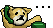
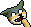
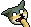
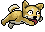
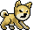
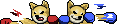
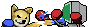

## dog [連狗]
| Filename | Emoji | GIF | PNG |
| --- | --- | --- | --- |
| smile | `#:)#dog` |  |  |
| hehe | `#hehe#dog` |  |  |
| haha | `#haha#dog` |  |  |
| bye | `#bye#dog` |  |  |
| 999 | `#999#dog` |  |  |
| on_hold | `#onhold#dog` |  |  |
| phone | `#phone#dog` |  |  |
| FBI | `#fbi#dog` |  |  |
| discover | `#discover#dog` |  |  |
| math | `#math#dog` |  |  |
| photo | `#photo#dog` |  |  |
| telescope | `#telescope#dog` |  |  |
| excited | `#excited#dog` |  |  |
| lick | `#:P#dog` |  |  |
| tasty | `#tasty#dog` |  |  |
| wet | `#wet#dog` |  |  |
| touch | `#touch#dog` |  |  |
| play | `#play#dog` |  |  |
| treat | `#treat#dog` |  |  |
| injection | `#injection#dog` |  |  |
| clean | `#clean#dog` |  |  |
| stop | `#stop#dog` |  |  |
| no | `#no#dog` |  |  |
| realized | `#realized#dog` |  |  |
| scare | `#@_@#dog` |  |  |
| angry | `#:-[#dog` |  |  |
| zzz | `#zzz#dog` |  |  |
| upset | `#upset#dog` |  |  |
| notcry | `#notcry#dog` |  |  |
| cry | `#cry#dog` |  |  |
| cheerup | `#cheerup#dog` |  |  |
| give | `#give#dog` |  |  |
| beg | `#beg#dog` |  |  |
| itdog0 | `#it0#dog` |  |  |
| itdog1 | `#it1#dog` |  |  |
| itdog2 | `#it2#dog` |  |  |
| itdog3 | `#it3#dog` |  |  |
| itdog4 | `#it4#dog` |  |  |
| itdog5 | `#it5#dog` |  |  |
| run | `#run#dog` |  |  |
| bark | `#bark#dog` |  |  |
| escape | `#escape#dog` |  |  |
| beat | `#beat#dog` |  |  |
| fight1 | `#fight1#dog` |  |  |
| fight2 | `#fight2#dog` |  |  |
| fight3 | `#fight3#dog` |  |  |
| npc2 | `#npc2#dog` |  |  |
| lihkg | `#lihkg#dog` |  |  |
| beg_connect | `undefined` |  |  |
| fight_connect | `undefined` |  |  |
| fight_connect2 | `undefined` |  |  |
| fight_connect3 | `undefined` |  |  |
| fight3_special | `undefined` |  |  |
| fight_special | `undefined` |  |  |
| fight3_connect | `undefined` |  |  |
| fight3_special2 | `undefined` |  |  |

