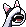
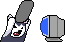
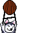
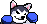

## husky [husky]

### Show On
From 1970-01-01T08:00:00+08:00

To 1970-01-01T08:00:00+08:00

| Filename | Emoji | GIF | PNG |
| --- | --- | --- | --- |
| smile | `#:)#husky` |  |  |
| hehe | `#hehe#husky` |  |  |
| haha | `#haha#husky` |  |  |
| bye | `#bye#husky` |  |  |
| 999 | `#999#husky` |  |  |
| FBI | `#fbi#husky` |  |  |
| lick | `#:P#husky` |  |  |
| wet | `#wet#husky` |  |  |
| touch | `#touch#husky` |  |  |
| no | `#no#husky` |  |  |
| scare | `#@_@#husky` |  |  |
| angry | `#:-[#husky` |  |  |
| zzz | `#zzz#husky` |  |  |
| cry | `#cry#husky` |  |  |
| give | `#give#husky` |  |  |
| beg | `#beg#husky` |  |  |
| itdog1 | `#it1#husky` |  |  |
| itdog2 | `#it2#husky` |  |  |
| run | `#run#husky` |  |  |
| beat | `#beat#husky` |  |  |
| fight1 | `#fight1#husky` |  |  |
| fight2 | `#fight2#husky` |  |  |
| lihkg | `#lihkg#husky` |  |  |
| beg_connect | `undefined` |  |  |
| beg_connect_AB | `undefined` |  |  |
| beg_connect_BA | `undefined` |  |  |
| fight_connect | `undefined` |  |  |
| fight_connect_AB | `undefined` |  |  |
| fight_connect_BA | `undefined` |  |  |

