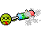
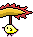
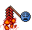
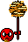

## lny [農曆新年版]

### Show On
From 2026-02-16T23:59:59+08:00

To 2026-02-26T00:00:00+08:00

| Filename | Emoji | GIF | PNG |
| --- | --- | --- | --- |
| smile | `#:)#lny` |  |  |
| smile2 | `#:)2#lny` |  |  |
| smile3 | `#:)3#lny` |  |  |
| angel | `#O:-)#lny` |  |  |
| dead | `#xx(#lny` |  |  |
| clown | `#:o)#lny` |  |  |
| clown2 | `#(o:#lny` |  |  |
| clown3 | `#:o)2#lny` |  |  |
| clown4 | `#(o:2#lny` |  |  |
| frown | `#:-(#lny` |  |  |
| wink | `#;-)#lny` |  |  |
| angry | `#:-[#lny` |  |  |
| devil | `#:-]#lny` |  |  |
| oh | `#:O#lny` |  |  |
| kiss | `#^3^#lny` |  |  |
| wonder | `#$_$#lny` |  |  |
| agree | `#[slick1]#lny` |  |  |
| agree2 | `#[slick2]#lny` |  |  |
| donno | `#ng#lny` |  |  |
| hehe | `#hehe#lny` |  |  |
| cry | `#:~(#lny` |  |  |
| biggrin | `#:D#lny` |  |  |
| tongue | `#:P#lny` |  |  |
| tongue2 | `#:P2#lny` |  |  |
| love | `#love#lny` |  |  |
| surprise | `#oh#lny` |  |  |
| chicken1 | `#cn1#lny` |  |  |
| chicken2 | `#cn2#lny` |  |  |
| chicken3 | `#cn3#lny` |  |  |
| ass | `#ass#lny` |  |  |
| sosad | `#[sosad]#lny` |  |  |
| good | `#good#lny` |  |  |
| hoho | `#hoho#lny` |  |  |
| kill | `#kill#lny` |  |  |
| bye | `#bye#lny` |  |  |
| z | `#Z_Z#lny` |  |  |
| @ | `#@_@#lny` |  |  |
| adore | `#adore#lny` |  |  |
| wonder2 | `#$$$#lny` |  |  |
| banghead | `#[banghead]#lny` |  |  |
| bouncer | `#[bouncer]#lny` |  |  |
| bouncy | `#[bouncy]#lny` |  |  |
| offtopic | `#[offtopic]#lny` |  |  |
| censored | `#[censored]#lny` |  |  |
| flowerface | `#[flowerface]#lny` |  |  |
| shocking | `#[shocking]#lny` |  |  |
| photo | `#[photo]#lny` |  |  |
| fire | `#fire#lny` |  |  |
| yipes10 | `#[yipes10]#lny` |  |  |
| yipes20 | `#[yipes20]#lny` |  |  |
| yipes50 | `#[yipes50]#lny` |  |  |
| yipes100 | `#[yipes100]#lny` |  |  |
| yipes500 | `#[yipes500]#lny` |  |  |
| yipes1000 | `#[yipes1000]#lny` |  |  |
| 369 | `#[369]#lny` |  |  |
| bomb | `#[bomb]#lny` |  |  |
| slick | `#[slick]#lny` |  |  |
| fuck | `#fuck#lny` |  |  |
| no | `#no#lny` |  |  |
| kill2 | `#kill2#lny` |  |  |

