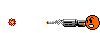

## normal [普通]
| Filename | Emoji | GIF | PNG |
| --- | --- | --- | --- |
| smile | `:)` |  |  |
| angel | `O:-)` |  |  |
| dead | `xx(` |  |  |
| clown | `:o)` |  |  |
| frown | `:-(` |  |  |
| cry | `:~(` |  |  |
| wink | `;-)` |  |  |
| angry | `:-[` |  |  |
| devil | `:-]` |  |  |
| biggrin | `:D` |  |  |
| oh | `:O` |  |  |
| tongue | `:P` |  |  |
| kiss | `^3^` |  |  |
| wonder | `?_?` |  |  |
| agree | `#yup#` |  |  |
| donno | `#ng#` |  |  |
| hehe | `#hehe#` |  |  |
| love | `#love#` |  |  |
| surprise | `#oh#` |  |  |
| chicken | `#cn#` |  |  |
| ass | `#ass#` |  |  |
| sosad | `[sosad]` |  |  |
| good | `#good#` |  |  |
| hoho | `#hoho#` |  |  |
| kill | `#kill#` |  |  |
| bye | `#bye#` |  |  |
| z | `Z_Z` |  |  |
| @ | `@_@` |  |  |
| adore | `#adore#` |  |  |
| wonder2 | `#???#` |  |  |
| banghead | `[banghead]` |  |  |
| bouncer | `[bouncer]` |  |  |
| bouncy | `[bouncy]` |  |  |
| offtopic | `[offtopic]` |  |  |
| censored | `[censored]` |  |  |
| flowerface | `[flowerface]` |  |  |
| shocking | `[shocking]` |  |  |
| photo | `[photo]` |  |  |
| fire | `#fire#` |  |  |
| yipes | `[yipes]` |  |  |
| 369 | `[369]` |  |  |
| bomb | `[bomb]` |  |  |
| slick | `[slick]` |  |  |
| fuck | `#fuck#` |  |  |
| no | `#no#` |  |  |
| kill2 | `#kill2#` |  |  |
| dislike | `#dislike#` |  |  |
| like | `#like#` |  |  |

