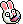

## rabbit [連兔]
| Filename | Emoji | GIF | PNG |
| --- | --- | --- | --- |
| smile | `#:)#rabbit` |  |  |
| smile2 | `#smile2#rabbit` |  |  |
| smile3 | `#smile3#rabbit` |  |  |
| happy | `#happy#rabbit` |  |  |
| haha | `#haha#rabbit` |  |  |
| clap | `#clap#rabbit` |  |  |
| agree | `#agree#rabbit` |  |  |
| music | `#music#rabbit` |  |  |
| bye | `#bye#rabbit` |  |  |
| blink | `#blink#rabbit` |  |  |
| hear | `#hear#rabbit` |  |  |
| confuse | `#confuse#rabbit` |  |  |
| wtf | `#wtf#rabbit` |  |  |
| angry | `#:-[#rabbit` |  |  |
| axe | `#axe#rabbit` |  |  |
| banghead | `#banghead#rabbit` |  |  |
| orange | `#orange#rabbit` |  |  |
| emo | `#emo#rabbit` |  |  |
| dance | `#dance#rabbit` |  |  |
| sweat | `#sweat#rabbit` |  |  |
| trauma | `#trauma#rabbit` |  |  |
| sad | `#sad#rabbit` |  |  |
| creepy | `#creepy#rabbit` |  |  |
| scary | `#scary#rabbit` |  |  |
| drink | `#drink#rabbit` |  |  |
| eat | `#eat#rabbit` |  |  |
| saw | `#saw#rabbit` |  |  |
| stun | `#stun#rabbit` |  |  |
| tape | `#tape#rabbit` |  |  |
| badboy | `#badboy#rabbit` |  |  |
| yawn | `#yawn#rabbit` |  |  |
| fly | `#fly#rabbit` |  |  |
| lihkg | `#lihkg#rabbit` |  |  |
| clap_special | `undefined` |  |  |
| eat_connect | `undefined` |  |  |
| hammer_connect | `undefined` |  |  |
| lihkg_special | `undefined` |  |  |
| roast_connect | `undefined` |  |  |
| roast_special | `undefined` |  |  |
| axe_connect | `undefined` |  |  |

