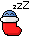
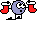

## xm [聖誕版]

### Show On
From 2025-12-15T00:00:00+08:00

To 2025-12-31T23:59:59+08:00

| Filename | Emoji | GIF | PNG |
| --- | --- | --- | --- |
| smile | `#:)#xm` |  |  |
| angel | `#O:-)#xm` |  |  |
| dead | `#xx(#xm` |  |  |
| clown | `#:o)#xm` |  |  |
| clown2 | `#:o)_2#xm` |  |  |
| frown | `#:-(#xm` |  |  |
| cry | `#:~(#xm` |  |  |
| wink | `#;-)#xm` |  |  |
| angry | `#:-[#xm` |  |  |
| devil | `#:-]#xm` |  |  |
| biggrin | `#:D#xm` |  |  |
| oh | `#:O#xm` |  |  |
| tongue | `#:P#xm` |  |  |
| kiss | `#^3^#xm` |  |  |
| wonder | `#?_?#xm` |  |  |
| agree | `#yup#xm` |  |  |
| donno | `#ng#xm` |  |  |
| hehe | `#hehe#xm` |  |  |
| love | `#love#xm` |  |  |
| chicken | `#cn#xm` |  |  |
| ass | `#ass#xm` |  |  |
| sosad | `#[sosad]#xm` |  |  |
| good | `#good#xm` |  |  |
| hoho | `#hoho#xm` |  |  |
| kill | `#kill#xm` |  |  |
| kill2 | `#kill#_2#xm` |  |  |
| bye | `#bye#xm` |  |  |
| z | `#Z_Z#xm` |  |  |
| @ | `#@_@#xm` |  |  |
| adore | `#adore#xm` |  |  |
| wonder2 | `#???#xm` |  |  |
| banghead | `#[banghead]#xm` |  |  |
| bouncer | `#[bouncer]#xm` |  |  |
| bouncy | `#[bouncy]#xm` |  |  |
| offtopic | `#[offtopic]#xm` |  |  |
| censored | `#[censored]#xm` |  |  |
| flowerface | `#[flowerface]#xm` |  |  |
| photo | `#[photo]#xm` |  |  |
| fire | `#fire#xm` |  |  |
| yipes | `#[yipes]#xm` |  |  |
| 369 | `#[369]#xm` |  |  |
| 369_2 | `#[369_2]#xm` |  |  |
| bomb | `#[bomb]#xm` |  |  |
| slick | `#[slick]#xm` |  |  |
| fuck | `#fuck#xm` |  |  |
| no | `#no#xm` |  |  |
| surprise_b | `#oh_b#xm` |  |  |
| surprise_g | `#oh_g#xm` |  |  |
| surprise_p | `#oh_p#xm` |  |  |
| surprise_r | `#oh_r#xm` |  |  |
| surprise_y | `#oh_y#xm` |  |  |
| shocking_b | `#[shocking_b]#xm` |  |  |
| shocking_g | `#[shocking_g]#xm` |  |  |
| shocking_p | `#[shocking_p]#xm` |  |  |
| shocking_r | `#[shocking_r]#xm` |  |  |
| shocking_y | `#[shocking_y]#xm` |  |  |
| 369_combo | `#[sosad]#xm #[369_2]#xm #[banghead]#xm` |  |  |
| clown_combo | `#adore#xm #:o)_2#xm` |  |  |
| angry_combo | `#:-[#xm #?_?#xm` |  |  |

