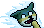
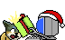
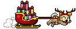
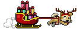
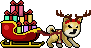
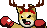

## dogxm [連狗聖誕版]
| Filename | Emoji | GIF | PNG |
| --- | --- | --- | --- |
| smile | `#:)#dogxm` |  |  |
| hehe | `#hehe#dogxm` |  |  |
| haha | `#haha#dogxm` |  |  |
| bye | `#bye#dogxm` |  |  |
| 999 | `#999#dogxm` |  |  |
| on_hold | `#onhold#dogxm` |  |  |
| phone | `#phone#dogxm` |  |  |
| FBI | `#fbi#dogxm` |  |  |
| discover | `#discover#dogxm` |  |  |
| math | `#math#dogxm` |  |  |
| photo | `#photo#dogxm` |  |  |
| telescope | `#telescope#dogxm` |  |  |
| excited | `#excited#dogxm` |  |  |
| lick | `#:P#dogxm` |  |  |
| tasty | `#tasty#dogxm` |  |  |
| wet | `#wet#dogxm` |  |  |
| touch | `#touch#dogxm` |  |  |
| play | `#play#dogxm` |  |  |
| treat | `#treat#dogxm` |  |  |
| injection | `#injection#dogxm` |  |  |
| clean | `#clean#dogxm` |  |  |
| stop | `#stop#dogxm` |  |  |
| no | `#no#dogxm` |  |  |
| realized | `#realized#dogxm` |  |  |
| scare | `#@_@#dogxm` |  |  |
| angry | `#:-[#dogxm` |  |  |
| zzz | `#zzz#dogxm` |  |  |
| upset | `#upset#dogxm` |  |  |
| notcry | `#notcry#dogxm` |  |  |
| cry | `#cry#dogxm` |  |  |
| cheerup | `#cheerup#dogxm` |  |  |
| give | `#give#dogxm` |  |  |
| beg | `#beg#dogxm` |  |  |
| itdog0 | `#it0#dogxm` |  |  |
| itdog1 | `#it1#dogxm` |  |  |
| itdog2 | `#it2#dogxm` |  |  |
| itdog3 | `#it3#dogxm` |  |  |
| itdog4 | `#it4#dogxm` |  |  |
| itdog5 | `#it5#dogxm` |  |  |
| run | `#run#dogxm` |  |  |
| bark | `#bark#dogxm` |  |  |
| escape | `#escape#dogxm` |  |  |
| beat | `#beat#dogxm` |  |  |
| fight1 | `#fight1#dogxm` |  |  |
| fight2 | `#fight2#dogxm` |  |  |
| npc2 | `#npc2#dogxm` |  |  |
| lihkg | `#lihkg#dogxm` |  |  |

