# All icons
## hb [hb]

### Show On
Keywords : 生日快樂, 生日, happy bday, happy Birthday, 🎂

| Filename | Emoji | GIF | PNG |
| --- | --- | --- | --- |
| smile_hb | `#:)#hb` |  |  |
| hb | `#hb2me#hb` |  |  |
| frown_hb | `#:-(#hb` |  |  |
| angry_hb | `#:-[#hb` |  |  |
| kiss_hb | `#^3^#hb` |  |  |
| adore_hb | `#adore#hb` |  |  |
| bomb_hb | `#[bomb]#hb` |  |  |
| dog_hb | `#dog#hb` |  |  |
| dog2_hb | `#dog2#hb` |  |  |
| dog3_hb | `#dog3#hb` |  |  |
| pig_hb | `#pig#hb` |  |  |
| pig2_hb | `#pig2#hb` | 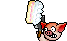 |  |
| pig3_hb | `#pig3#hb` | 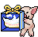 |  |
| mouse_hb | `#mouse#hb` |  |  |
| mouse2_hb | `#mouse2#hb` |  |  |
| cat_hb | `#cat#hb` |  |  |
| cat2_hb | `#cat2#hb` |  |  |
| cow1_hb | `#cow1#hb` |  |  |
| cow2_hb | `#cow2#hb` |  |  |
| cow3_hb | `#cow3#hb` |  |  |
| tiger_hb | `#tiger#hb` |  |  |
| tiger2_hb | `#tiger2#hb` |  |  |
| tiger3_hb | `#tiger3#hb` |  |  |
| rabbit_hb | `#rabbit#hb` |  |  |
| rabbit2_hb | `#rabbit2#hb` |  |  |
| rabbit3_hb | `#rabbit3#hb` |  |  |
| dragon_hb | `#dragon#hb` |  |  |
| dragon_hb2 | `#dragon2#hb` |  |  |
| snake_hb | `#snake#hb` |  |  |
| snake_hb2 | `#snake2#hb` | 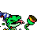 |  |
| horse_hb | `#horse#hb` |  |  |
| horse_hb2 | `#horse2#hb` |  |  |
| rabbit_hb_connect | `#cow2#hb #rabbit2#hb` |  |  |
| dragon_hb_connect | `#dragon#hb #mouse2#hb` |  |  |

## rip [RIP]

### Show On
Keywords : rip, 悼念, 哀悼, r.i.p

| Filename | Emoji | GIF | PNG |
| --- | --- | --- | --- |
| flower | `#flower#rip` |  |  |
| dog | `#dog#rip` |  |  |
| pig | `#pig#rip` |  |  |
| mouse | `#mouse#rip` |  |  |
| cat | `#cat#rip` |  | 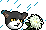 |
| cow | `#cow#rip` |  |  |
| tiger | `#tiger#rip` |  |  |
| rabbit | `#rabbit#rip` |  |  |
| dragon | `#dragon#rip` |  |  |
| snake | `#snake#rip` |  |  |
| horse | `#horse#rip` |  |  |

## xm [聖誕版]

### Show On
From 2025-12-15T00:00:00+08:00

To 2025-12-31T23:59:59+08:00

| Filename | Emoji | GIF | PNG |
| --- | --- | --- | --- |
| smile | `#:)#xm` |  |  |
| angel | `#O:-)#xm` |  |  |
| dead | `#xx(#xm` |  |  |
| clown | `#:o)#xm` |  |  |
| clown2 | `#:o)_2#xm` |  |  |
| frown | `#:-(#xm` |  |  |
| cry | `#:~(#xm` |  |  |
| wink | `#;-)#xm` |  |  |
| angry | `#:-[#xm` |  |  |
| devil | `#:-]#xm` |  |  |
| biggrin | `#:D#xm` |  |  |
| oh | `#:O#xm` |  |  |
| tongue | `#:P#xm` |  |  |
| kiss | `#^3^#xm` |  |  |
| wonder | `#?_?#xm` |  |  |
| agree | `#yup#xm` |  |  |
| donno | `#ng#xm` |  |  |
| hehe | `#hehe#xm` |  |  |
| love | `#love#xm` |  |  |
| chicken | `#cn#xm` |  |  |
| ass | `#ass#xm` |  |  |
| sosad | `#[sosad]#xm` |  |  |
| good | `#good#xm` |  |  |
| hoho | `#hoho#xm` |  |  |
| kill | `#kill#xm` |  |  |
| kill2 | `#kill#_2#xm` |  |  |
| bye | `#bye#xm` |  |  |
| z | `#Z_Z#xm` | 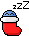 | 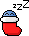 |
| @ | `#@_@#xm` |  |  |
| adore | `#adore#xm` |  | 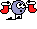 |
| wonder2 | `#???#xm` |  |  |
| banghead | `#[banghead]#xm` | 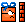 |  |
| bouncer | `#[bouncer]#xm` |  |  |
| bouncy | `#[bouncy]#xm` |  | 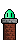 |
| offtopic | `#[offtopic]#xm` |  | 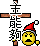 |
| censored | `#[censored]#xm` |  |  |
| flowerface | `#[flowerface]#xm` |  |  |
| photo | `#[photo]#xm` |  |  |
| fire | `#fire#xm` |  |  |
| yipes | `#[yipes]#xm` |  |  |
| 369 | `#[369]#xm` |  |  |
| 369_2 | `#[369_2]#xm` |  |  |
| bomb | `#[bomb]#xm` |  |  |
| slick | `#[slick]#xm` |  |  |
| fuck | `#fuck#xm` |  |  |
| no | `#no#xm` |  |  |
| surprise_b | `#oh_b#xm` |  |  |
| surprise_g | `#oh_g#xm` |  |  |
| surprise_p | `#oh_p#xm` |  |  |
| surprise_r | `#oh_r#xm` |  |  |
| surprise_y | `#oh_y#xm` |  |  |
| shocking_b | `#[shocking_b]#xm` |  |  |
| shocking_g | `#[shocking_g]#xm` |  |  |
| shocking_p | `#[shocking_p]#xm` |  |  |
| shocking_r | `#[shocking_r]#xm` |  |  |
| shocking_y | `#[shocking_y]#xm` |  |  |
| 369_combo | `#[sosad]#xm #[369_2]#xm #[banghead]#xm` |  |  |
| clown_combo | `#adore#xm #:o)_2#xm` | 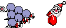 |  |
| angry_combo | `#:-[#xm #?_?#xm` |  |  |

## snakexm [snakexm]

### Show On
From 2025-12-15T00:00:00+08:00

To 2025-12-31T23:59:59+08:00

| Filename | Emoji | GIF | PNG |
| --- | --- | --- | --- |
| smile | `#:)#snakexm` |  |  |
| laugh | `#:D#snakexm` |  |  |
| nose | `#nose#snakexm` |  |  |
| want | `#want#snakexm` |  |  |
| knife | `#knife#snakexm` |  |  |
| shotgun | `#shotgun#snakexm` |  |  |
| explosion | `#explosion#snakexm` |  |  |
| sweat | `#sweat#snakexm` |  |  |
| write | `#write#snakexm` |  |  |
| confuse | `#confuse#snakexm` |  |  |
| wtf | `#wtf#snakexm` |  |  |
| scream | `#scream#snakexm` |  | 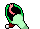 |
| shock | `#shock#snakexm` |  |  |
| wow | `#wow#snakexm` |  |  |
| boring | `#boring#snakexm` |  |  |
| sad | `#sad#snakexm` |  |  |
| sad2 | `#sad2#snakexm` |  |  |
| bye | `#bye#snakexm` |  |  |
| eat | `#eat#snakexm` |  |  |
| drink | `#drink#snakexm` |  |  |
| think | `#think#snakexm` |  |  |
| hypnosis | `#hypnosis#snakexm` |  |  |
| arcade | `#arcade#snakexm` |  |  |
| sign | `#sign#snakexm` |  |  |
| zzz | `#zzz#snakexm` |  |  |
| lihkg | `#lihkg#snakexm` |  |  |

## dogxm [連狗聖誕版]

### Show On
From 2025-12-15T00:00:00+08:00

To 2025-12-31T23:59:59+08:00

| Filename | Emoji | GIF | PNG |
| --- | --- | --- | --- |
| smile | `#:)#dogxm` |  |  |
| hehe | `#hehe#dogxm` |  |  |
| haha | `#haha#dogxm` |  |  |
| bye | `#bye#dogxm` |  |  |
| 999 | `#999#dogxm` |  |  |
| on_hold | `#onhold#dogxm` |  |  |
| phone | `#phone#dogxm` |  |  |
| FBI | `#fbi#dogxm` |  |  |
| discover | `#discover#dogxm` |  |  |
| math | `#math#dogxm` |  |  |
| photo | `#photo#dogxm` |  |  |
| telescope | `#telescope#dogxm` |  |  |
| excited | `#excited#dogxm` |  |  |
| lick | `#:P#dogxm` |  |  |
| tasty | `#tasty#dogxm` |  |  |
| wet | `#wet#dogxm` |  |  |
| touch | `#touch#dogxm` |  |  |
| play | `#play#dogxm` |  |  |
| treat | `#treat#dogxm` |  |  |
| injection | `#injection#dogxm` |  |  |
| clean | `#clean#dogxm` |  |  |
| stop | `#stop#dogxm` |  |  |
| no | `#no#dogxm` |  |  |
| realized | `#realized#dogxm` |  |  |
| scare | `#@_@#dogxm` |  |  |
| angry | `#:-[#dogxm` |  |  |
| zzz | `#zzz#dogxm` |  |  |
| upset | `#upset#dogxm` |  |  |
| notcry | `#notcry#dogxm` |  |  |
| cry | `#cry#dogxm` |  |  |
| cheerup | `#cheerup#dogxm` |  |  |
| give | `#give#dogxm` |  |  |
| beg | `#beg#dogxm` |  |  |
| itdog0 | `#it0#dogxm` |  |  |
| itdog1 | `#it1#dogxm` |  |  |
| itdog2 | `#it2#dogxm` |  |  |
| itdog3 | `#it3#dogxm` |  |  |
| itdog4 | `#it4#dogxm` |  |  |
| itdog5 | `#it5#dogxm` |  |  |
| run | `#run#dogxm` |  |  |
| bark | `#bark#dogxm` |  |  |
| escape | `#escape#dogxm` |  |  |
| beat | `#beat#dogxm` |  |  |
| fight1 | `#fight1#dogxm` |  |  |
| fight2 | `#fight2#dogxm` | 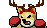 |  |
| npc2 | `#npc2#dogxm` |  |  |
| lihkg | `#lihkg#dogxm` |  |  |
| beg_connect | `#give#dogxm #beg#dogxm` |  |  |
| fight_connect | `#fight1#dogxm #fight2#dogxm` |  |  |
| fight_connect2 | `#fight2#dogxm #fight1#dogxm` | 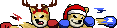 |  |
| fight_connect3 | `#fight1#dogxm #npc2#dogxm` |  |  |

## pigxm [連豬聖誕版]

### Show On
From 2025-12-15T00:00:00+08:00

To 2025-12-31T23:59:59+08:00

| Filename | Emoji | GIF | PNG |
| --- | --- | --- | --- |
| smile | `#:)#pigxm` |  |  |
| hate | `#:[#pigxm` |  |  |
| smirk | `#:-]#pigxm` |  |  |
| hehe | `#hehe#pigxm` |  |  |
| mock | `#mock#pigxm` |  |  |
| clap | `#clap#pigxm` |  |  |
| snowhat | `#snowhat#pigxm` |  |  |
| bye | `#bye#pigxm` |  |  |
| cut | `#cut#pigxm` |  |  |
| cook | `#cooking#pigxm` |  |  |
| fry | `#fry#pigxm` |  |  |
| fan | `#fan#pigxm` |  |  |
| peanut | `#peanut#pigxm` |  |  |
| wine | `#wine#pigxm` |  |  |
| champagne | `#champagne#pigxm` |  |  |
| play | `#play#pigxm` |  |  |
| whip | `#whip#pigxm` |  |  |
| shocked | `#shocking#pigxm` |  |  |
| read | `#read#pigxm` |  |  |
| heard | `#heard#pigxm` |  |  |
| nope | `#nope#pigxm` |  |  |
| pointing | `#pointing#pigxm` |  |  |
| argue | `#argue#pigxm` |  |  |
| drum | `#drum#pigxm` |  |  |
| speakerphone | `#speakerphone#pigxm` |  |  |
| sad_n_angry | `#;-[#pigxm` |  |  |
| angry | `#:-[#pigxm` |  |  |
| knife | `#kill#pigxm` |  |  |
| arrested | `#arrested#pigxm` |  |  |
| upset_r | `#upset_r#pigxm` |  |  |
| wail_r | `#wail_r#pigxm` |  |  |
| wail2_r | `#wail2_r#pigxm` |  |  |
| wail3_r | `#wail3_r#pigxm` |  |  |
| arrested_g | `#arrested_g#pigxm` |  |  |
| upset | `#upset#pigxm` |  |  |
| wail | `#wail#pigxm` |  |  |
| wail2 | `#wail2#pigxm` |  |  |
| wail3 | `#wail3#pigxm` |  |  |
| sick | `#sick#pigxm` |  |  |
| dance | `#dance#pigxm` |  |  |
| dance2 | `#dance2#pigxm` |  |  |
| dance3 | `#dance3#pigxm` |  |  |
| dance4 | `#dance4#pigxm` |  |  |
| rolling | `#rolling#pigxm` |  |  |
| dying | `#dying#pigxm` |  |  |
| surviving | `#surviving#pigxm` |  |  |
| free | `#free#pigxm` |  | 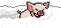 |
| lihkg | `#lihkg#pigxm` |  |  |
| whip_special | `#play#pigxm #whip#pigxm` | 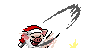 |  |
| whip_connect | `#whip#pigxm #fight2#dogxm` |  |  |
| knife_connect | `#fight1#dogxm #kill#pigxm` |  |  |
| argue_connect | `#stop#dogxm #argue#pigxm` |  |  |
| cook_connect | `#cooking#pigxm #fan#pigxm` |  |  |

## mousexm [連鼠聖誕版]

### Show On
From 2025-12-15T00:00:00+08:00

To 2025-12-31T23:59:59+08:00

| Filename | Emoji | GIF | PNG |
| --- | --- | --- | --- |
| smile | `#:)#mousexm` |  |  |
| pray | `#pray#mousexm` |  |  |
| please | `#please#mousexm` |  |  |
| miracle | `#miracle#mousexm` |  |  |
| yea | `#yea#mousexm` |  |  |
| ohyes | `#ohyes#mousexm` |  |  |
| bye | `#bye#mousexm` |  |  |
| fuck | `#fuck#mousexm` |  |  |
| short | `#short#mousexm` |  |  |
| there | `#there#mousexm` |  |  |
| tea | `#tea#mousexm` |  |  |
| cheer | `#cheer#mousexm` |  |  |
| cheerleading | `#cheerleading#mousexm` |  |  |
| love | `#love#mousexm` |  |  |
| awake | `#awake#mousexm` |  |  |
| vampire | `#vampire#mousexm` |  |  |
| coffin | `#coffin#mousexm` |  |  |
| cross | `#cross#mousexm` |  |  |
| crystalball | `#crystalball#mousexm` |  |  |
| potion | `#potion#mousexm` |  |  |
| solution | `#solution#mousexm` |  |  |
| gun | `#gun#mousexm` |  |  |
| medicine | `#medicine#mousexm` |  |  |
| how | `#how#mousexm` |  |  |
| what | `#what#mousexm` |  |  |
| scratching | `#scratching#mousexm` |  |  |
| ohno | `#ohno#mousexm` |  |  |
| notcry | `#notcry#mousexm` |  |  |
| cry | `#cry#mousexm` |  |  |
| cryalot | `#cryalot#mousexm` |  |  |
| tired | `#tired#mousexm` |  |  |
| blah | `#blah#mousexm` |  |  |
| sigh | `#sigh#mousexm` |  |  |
| annoyed | `#annoyed#mousexm` |  |  |
| rubbish | `#rubbish#mousexm` |  | 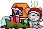 |
| lihkg | `#lihkg#mousexm` |  |  |
| smile_special | `#:)#mousexm #stare#catxm` |  |  |
| vampire_special | `#awake#mousexm #vampire#mousexm` |  |  |
| gun_connect | `#gun#mousexm #disappointed#catxm` |  |  |
| stop_medicine_argue_connect | `#stop#dogxm #medicine#mousexm #argue#pigxm` |  |  |
| miracle_special | `#pray#mousexm #please#mousexm #miracle#mousexm` |  |  |

## catxm [連貓聖誕版]

### Show On
From 2025-12-15T00:00:00+08:00

To 2025-12-31T23:59:59+08:00

| Filename | Emoji | GIF | PNG |
| --- | --- | --- | --- |
| smile | `#:)#catxm` |  |  |
| lick | `#:P#catxm` |  |  |
| nap | `#nap#catxm` |  |  |
| bye | `#bye#catxm` |  |  |
| stare | `#stare#catxm` |  |  |
| handup | `#handup#catxm` |  |  |
| annoyed | `#annoyed#catxm` |  |  |
| headache | `#headache#catxm` |  |  |
| throw | `#throw#catxm` |  |  |
| angry | `#:-[#catxm` |  |  |
| appear | `#appear#catxm` |  |  |
| darkness | `#darkness#catxm` |  | 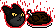 |
| threat | `#threat#catxm` |  |  |
| swipe | `#swipe#catxm` |  |  |
| rain | `#rain#catxm` |  |  |
| shaking | `#shaking#catxm` |  |  |
| sneeze | `#sneeze#catxm` |  |  |
| mask | `#mask#catxm` |  |  |
| unwell | `#xx(#catxm` |  |  |
| disappointed | `#disappointed#catxm` |  |  |
| angel | `#O:-)#catxm` |  |  |
| pussy1 | `#pussy1#catxm` |  |  |
| pussy2 | `#pussy2#catxm` |  |  |
| stretching | `#stretching#catxm` |  |  |
| lucky | `#lucky#catxm` |  |  |
| lihkg | `#lihkg#catxm` |  |  |
| throw_connect | `#throw#catxm #beg#dogxm` |  |  |

## cowxm [連牛聖誕版]

### Show On
From 2025-12-15T00:00:00+08:00

To 2025-12-31T23:59:59+08:00

| Filename | Emoji | GIF | PNG |
| --- | --- | --- | --- |
| smile | `#:)#cowxm` |  |  |
| hehe | `#hehe#cowxm` |  |  |
| sad | `#sad#cowxm` |  |  |
| sosad | `#sosad#cowxm` |  |  |
| sweat | `#sweat#cowxm` |  |  |
| bye | `#bye#cowxm` |  |  |
| hair | `#hair#cowxm` |  |  |
| slap | `#slap#cowxm` |  |  |
| sadbutsmile | `#sadbutsmile#cowxm` |  |  |
| door | `#door#cowxm` |  |  |
| grab | `#grab#cowxm` |  |  |
| no | `#no#cowxm` |  |  |
| sleep | `#sleep#cowxm` |  |  |
| plan | `#plan#cowxm` |  |  |
| scheme | `#scheme#cowxm` |  |  |
| arrogant | `#arrogant#cowxm` |  |  |
| cigar | `#cigar#cowxm` |  |  |
| wa | `#wa#cowxm` |  |  |
| unexpected | `#unexpected#cowxm` |  |  |
| ball | `#ball#cowxm` |  |  |
| medal | `#medal#cowxm` |  |  |
| gold | `#gold#cowxm` |  |  |
| power | `#power#cowxm` |  |  |
| sorry | `#sorry#cowxm` |  |  |
| arrr | `#arrr#cowxm` |  |  |
| crowd | `#crowd#cowxm` | 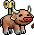 |  |
| bus | `#bus#cowxm` |  |  |
| bicycle | `#bicycle#cowxm` |  |  |
| car | `#car#cowxm` |  |  |
| linguistic | `#linguistic#cowxm` |  |  |
| lihkg | `#lihkg#cowxm` |  |  |
| power_special | `#gold#cowxm #power#cowxm` |  |  |
| bus_special | `#crowd#cowxm #bus#cowxm` |  |  |
| grab_connect | `#grab#cowxm #beg#dogxm` |  |  |
| bicycle_connect | `#whip#pigxm #bicycle#cowxm` |  |  |

## tigerxm [連虎聖誕版]

### Show On
From 2025-12-15T00:00:00+08:00

To 2025-12-31T23:59:59+08:00

| Filename | Emoji | GIF | PNG |
| --- | --- | --- | --- |
| smile | `#:)#tigerxm` |  |  |
| happy | `#happy#tigerxm` |  |  |
| slap | `#slap#tigerxm` |  |  |
| bye | `#bye#tigerxm` |  |  |
| hello | `#hello#tigerxm` |  |  |
| glasses | `#glasses#tigerxm` |  |  |
| money | `#money#tigerxm` |  |  |
| sad | `#sad#tigerxm` |  |  |
| sweat | `#sweat#tigerxm` |  |  |
| donno | `#donno#tigerxm` |  |  |
| no | `#no#tigerxm` |  |  |
| angry | `#angry#tigerxm` |  |  |
| fire | `#fire#tigerxm` |  |  |
| oh | `#oh#tigerxm` |  |  |
| nlhg | `#nlhg#tigerxm` |  |  |
| pcr | `#pcr#tigerxm` |  |  |
| popcorn | `#popcorn#tigerxm` |  |  |
| champagne | `#champagne#tigerxm` |  |  |
| like | `#like#tigerxm` |  |  |
| like2 | `#like2#tigerxm` |  |  |
| iwantall | `#iwantall#tigerxm` |  |  |
| punchbag | `#punchbag#tigerxm` |  |  |
| rpg7 | `#rpg7#tigerxm` | 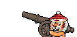 |  |
| lihkg | `#lihkg#tigerxm` |  |  |
| lihkg2 | `#lihkg2#tigerxm` |  |  |
| fire_special | `#angry#tigerxm #fire#tigerxm` |  |  |
| sad_special | `#sad#tigerxm #happy#tigerxm` |  |  |
| shock_special | `#oh#tigerxm #nlhg#tigerxm` |  |  |
| like_special | `#like#tigerxm #like#tigerxm` | 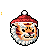 |  |
| punch_special | `#punchbag#tigerxm #angry#tigerxm` | 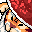 |  |
| punchbag_connect | `#punchbag#tigerxm #fight2#dogxm` |  |  |
| lihkg_connect | `#lihkg#tigerxm #drum#pigxm` |  |  |
| money_connect | `#money#tigerxm #sorry#cowxm` |  |  |

## rabbitxm [連兔聖誕版]

### Show On
From 2025-12-15T00:00:00+08:00

To 2025-12-31T23:59:59+08:00

| Filename | Emoji | GIF | PNG |
| --- | --- | --- | --- |
| smile | `#:)#rabbitxm` |  |  |
| smile2 | `#smile2#rabbitxm` |  |  |
| happy | `#happy#rabbitxm` |  |  |
| haha | `#haha#rabbitxm` |  |  |
| clap | `#clap#rabbitxm` |  |  |
| agree | `#agree#rabbitxm` |  |  |
| music | `#music#rabbitxm` |  |  |
| bye | `#bye#rabbitxm` |  |  |
| blink | `#blink#rabbitxm` |  |  |
| hear | `#hear#rabbitxm` |  |  |
| confuse | `#confuse#rabbitxm` |  |  |
| wtf | `#wtf#rabbitxm` |  |  |
| angry | `#:-[#rabbitxm` |  |  |
| axe | `#axe#rabbitxm` |  |  |
| banghead | `#banghead#rabbitxm` |  |  |
| orange | `#orange#rabbitxm` |  |  |
| emo | `#emo#rabbitxm` |  |  |
| dance | `#dance#rabbitxm` |  |  |
| sweat | `#sweat#rabbitxm` |  |  |
| trauma | `#trauma#rabbitxm` |  |  |
| sad | `#sad#rabbitxm` |  |  |
| creepy | `#creepy#rabbitxm` |  |  |
| scary | `#scary#rabbitxm` |  |  |
| drink | `#drink#rabbitxm` |  |  |
| eat | `#eat#rabbitxm` |  |  |
| saw | `#saw#rabbitxm` |  |  |
| stun | `#stun#rabbitxm` |  |  |
| tape | `#tape#rabbitxm` |  |  |
| yawn | `#yawn#rabbitxm` |  |  |
| fly | `#fly#rabbitxm` |  |  |
| lihkg | `#lihkg#rabbitxm` |  |  |
| clap_special | `#clap#rabbitxm #creepy#rabbitxm` |  |  |
| eat_connect | `#eat#rabbitxm #eating#lm2xm` |  |  |
| hammer_connect | `#it3#dogxm #axe#rabbitxm` |  |  |
| lihkg_special | `#saw#rabbitxm #lihkg#rabbitxm` |  |  |
| roast_connect | `#cooking#pigxm #:)#rabbitxm` |  |  |
| roast_connect2 | `#:)#rabbitxm #cooking#pigxm` |  |  |
| axe_connect | `#car#cowxm #axe#rabbitxm` |  |  |
| roast_connect3 | `#:)#rabbitxm #kill#pigxm` |  |  |
| saw_connect | `#saw#rabbitxm #gun#mousexm` |  |  |

## dragonxm [dragonxm]

### Show On
From 2025-12-15T00:00:00+08:00

To 2025-12-31T23:59:59+08:00

| Filename | Emoji | GIF | PNG |
| --- | --- | --- | --- |
| smile | `#:)#dragonxm` |  |  |
| happy | `#:D#dragonxm` |  |  |
| unclehappy | `#unclehappy#dragonxm` |  |  |
| unclehappy2 | `#unclehappy2#dragonxm` |  |  |
| lick | `#lick#dragonxm` |  |  |
| lick2 | `#lick2#dragonxm` |  |  |
| gj | `#gj#dragonxm` |  |  |
| disappear | `#disappear#dragonxm` |  |  |
| guitar | `#guitar#dragonxm` |  |  |
| bye | `#bye#dragonxm` |  |  |
| eat | `#eat#dragonxm` |  |  |
| ok | `#ok#dragonxm` |  |  |
| drink | `#drink#dragonxm` |  |  |
| think | `#think#dragonxm` |  |  |
| wtf | `#wtf#dragonxm` |  |  |
| phone | `#phone#dragonxm` |  |  |
| ngg | `#ngg#dragonxm` |  |  |
| mindblown | `#mindblown#dragonxm` |  |  |
| wheelchair | `#wheelchair#dragonxm` | 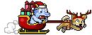 |  |
| angry | `#:-[#dragonxm` |  |  |
| headache | `#headache#dragonxm` |  |  |
| spit | `#spit#dragonxm` |  |  |
| midfinger | `#midfinger#dragonxm` |  |  |
| laser | `#laser#dragonxm` |  |  |
| read | `#read#dragonxm` |  |  |
| sad | `#sad#dragonxm` |  |  |
| sad2 | `#sad2#dragonxm` |  |  |
| nope | `#nope#dragonxm` |  |  |
| shock | `#shock#dragonxm` |  |  |
| backpain | `#backpain#dragonxm` |  |  |
| shiver | `#shiver#dragonxm` |  |  |
| z | `#z#dragonxm` |  |  |
| wind | `#wind#dragonxm` |  |  |
| lihkg | `#lihkg#dragonxm` |  |  |
| angry_connect | `#spit#dragonxm #gun#mousexm` |  |  |
| angry_connect2 | `#:-[#dragonxm #tired#mousexm` |  |  |
| angry_special | `#:-[#dragonxm #midfinger#dragonxm` |  |  |
| backpain_connect | `#throw#catxm #backpain#dragonxm` |  |  |
| wheelchair_connect | `#car#cowxm #wheelchair#dragonxm` |  |  |

## lm2xm [腦魔2聖誕版]

### Show On
From 2025-12-15T00:00:00+08:00

To 2025-12-31T23:59:59+08:00

| Filename | Emoji | GIF | PNG |
| --- | --- | --- | --- |
| smile | `#:)#lm2xm` |  |  |
| clown | `#:o)#lm2xm` |  |  |
| kill | `#kill#lm2xm` |  |  |
| shield | `#shield#lm2xm` |  |  |
| bye | `#bye#lm2xm` |  |  |
| eating | `#eating#lm2xm` |  |  |
| yo | `#yo#lm2xm` |  |  |
| sosick | `#[sosick]#lm2xm` |  |  |
| mask | `#mask#lm2xm` |  |  |
| diu | `#diu#lm2xm` |  |  |
| touch | `#touch#lm2xm` |  |  |
| wet | `#wet#lm2xm` |  |  |
| jable | `#jable#lm2xm` |  |  |
| tongue | `#:P#lm2xm` |  |  |
| lick | `#lick#lm2xm` |  |  |
| spinning | `#spinning#lm2xm` |  |  |
| spinning2 | `#spinning2#lm2xm` |  |  |
| bouncer | `#[bouncer]#lm2xm` |  |  |
| dead | `#xx(#lm2xm` |  |  |
| wonder2 | `#???#lm2xm` |  |  |
| wfc2 | `#wfc2#lm2xm` |  |  |
| support | `#support#lm2xm` |  |  |
| sosad | `#[sosad]#lm2xm` |  |  |
| haha | `#haha#lm2xm` |  |  |
| nosee | `#nosee#lm2xm` |  |  |
| hoho | `#hoho#lm2xm` |  |  |
| love | `#love#lm2xm` |  |  |
| hehe | `#hehe#lm2xm` |  |  |
| photo | `#[photo]#lm2xm` |  |  |
| point1 | `#point1#lm2xm` |  |  |
| point2 | `#point2#lm2xm` |  |  |
| beer | `#beer#lm2xm` |  |  |
| agree | `#yup#lm2xm` |  |  |
| slick | `#[slick]#lm2xm` |  |  |
| yeah | `#yeah#lm2xm` |  |  |
| donno | `#ng#lm2xm` |  |  |
| no | `#no#lm2xm` |  |  |
| brain | `#brain#lm2xm` |  |  |
| oh | `#:O#lm2xm` |  |  |
| bang | `#bang#lm2xm` |  |  |
| silly | `#silly#lm2xm` |  |  |
| 369 | `#[369]#lm2xm` |  |  |
| dllm | `#dllm#lm2xm` |  |  |
| fuck | `#fuck#lm2xm` |  |  |
| bomb2 | `#[bomb2]#lm2xm` |  |  |
| bomb | `#[bomb]#lm2xm` |  |  |
| shoot | `#shoot#lm2xm` |  |  |
| hate | `#hate#lm2xm` |  |  |
| angry | `#:-[#lm2xm` |  |  |
| aura | `#aura#lm2xm` |  |  |
| saber | `#saber#lm2xm` |  |  |
| danger | `#danger#lm2xm` | 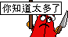 | 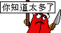 |
| dislike | `#dislike#lm2xm` |  |  |
| good | `#good#lm2xm` |  |  |
| ok | `#ok#lm2xm` |  |  |
| go | `#go#lm2xm` |  |  |
| drop | `#drop#lm2xm` |  |  |
| rise | `#rise#lm2xm` |  |  |
| wfc | `#wfc#lm2xm` |  |  |
| think | `#think#lm2xm` |  |  |
| adore | `#adore#lm2xm` |  |  |
| kiss2 | `#^3^#lm2xm` |  |  |
| kiss | `#kiss#lm2xm` |  |  |
| nothing | `#nothing#lm2xm` |  |  |
| flowerface | `#[flowerface]#lm2xm` |  |  |
| frown | `#:-(#lm2xm` |  |  |
| frownsmile | `#frownsmile#lm2xm` |  |  |
| z | `#Z_Z#lm2xm` |  |  |
| noodles | `#noodles#lm2xm` |  |  |
| lightbulb | `#lightbulb#lm2xm` |  |  |
| abomb | `#[abomb]#lm2xm` |  |  |
| selfdestruct | `#selfdestruct#lm2xm` |  |  |
| shocking | `#[shocking]#lm2xm` |  |  |
| @ | `#@_@#lm2xm` |  |  |
| yipes | `#[yipes]#lm2xm` |  |  |
| cry | `#:~(#lm2xm` |  |  |
| dust | `#dust#lm2xm` |  |  |
| credit | `#credit#lm2xm` |  |  |

## lny [農曆新年版]

### Show On
From 2026-02-16T23:59:59+08:00

To 2026-02-26T00:00:00+08:00

| Filename | Emoji | GIF | PNG |
| --- | --- | --- | --- |
| smile | `#:)#lny` |  |  |
| smile2 | `#:)2#lny` |  |  |
| smile3 | `#:)3#lny` |  |  |
| angel | `#O:-)#lny` |  |  |
| dead | `#xx(#lny` |  |  |
| clown | `#:o)#lny` |  |  |
| clown2 | `#(o:#lny` |  |  |
| clown3 | `#:o)2#lny` |  |  |
| clown4 | `#(o:2#lny` |  |  |
| frown | `#:-(#lny` |  |  |
| wink | `#;-)#lny` |  |  |
| angry | `#:-[#lny` |  |  |
| devil | `#:-]#lny` |  |  |
| oh | `#:O#lny` |  |  |
| kiss | `#^3^#lny` |  |  |
| wonder | `#$_$#lny` |  |  |
| agree | `#[slick1]#lny` |  |  |
| agree2 | `#[slick2]#lny` |  |  |
| donno | `#ng#lny` |  |  |
| hehe | `#hehe#lny` |  |  |
| cry | `#:~(#lny` |  |  |
| biggrin | `#:D#lny` |  |  |
| tongue | `#:P#lny` |  |  |
| tongue2 | `#:P2#lny` |  |  |
| love | `#love#lny` |  |  |
| surprise | `#oh#lny` |  |  |
| chicken1 | `#cn1#lny` |  |  |
| chicken2 | `#cn2#lny` |  |  |
| chicken3 | `#cn3#lny` |  |  |
| ass | `#ass#lny` |  |  |
| sosad | `#[sosad]#lny` |  |  |
| good | `#good#lny` |  |  |
| hoho | `#hoho#lny` |  |  |
| kill | `#kill#lny` |  |  |
| bye | `#bye#lny` |  |  |
| z | `#Z_Z#lny` |  |  |
| @ | `#@_@#lny` |  |  |
| adore | `#adore#lny` |  |  |
| wonder2 | `#$$$#lny` |  |  |
| banghead | `#[banghead]#lny` |  |  |
| bouncer | `#[bouncer]#lny` |  |  |
| bouncy | `#[bouncy]#lny` |  |  |
| offtopic | `#[offtopic]#lny` |  |  |
| censored | `#[censored]#lny` |  |  |
| flowerface | `#[flowerface]#lny` |  |  |
| shocking | `#[shocking]#lny` |  |  |
| photo | `#[photo]#lny` |  |  |
| fire | `#fire#lny` |  |  |
| yipes10 | `#[yipes10]#lny` |  |  |
| yipes20 | `#[yipes20]#lny` |  |  |
| yipes50 | `#[yipes50]#lny` |  |  |
| yipes100 | `#[yipes100]#lny` |  |  |
| yipes500 | `#[yipes500]#lny` |  |  |
| yipes1000 | `#[yipes1000]#lny` |  |  |
| 369 | `#[369]#lny` |  |  |
| bomb | `#[bomb]#lny` |  |  |
| slick | `#[slick]#lny` |  |  |
| fuck | `#fuck#lny` |  |  |
| no | `#no#lny` |  |  |
| kill2 | `#kill2#lny` |  |  |

## mf [中秋節版]

### Show On
From 2025-10-05T00:00:00+08:00

To 2025-10-09T00:00:00+08:00

| Filename | Emoji | GIF | PNG |
| --- | --- | --- | --- |
| smile | `#:)#mf` |  |  |
| angel | `#O:-)#mf` |  |  |
| dead | `#xx(#mf` |  |  |
| clown | `#:o)#mf` |  |  |
| frown | `#:-(#mf` |  |  |
| cry | `#:~(#mf` |  |  |
| wink | `#;-)#mf` |  |  |
| angry | `#:-[#mf` |  |  |
| devil | `#:-]#mf` |  |  |
| biggrin | `#:D#mf` |  |  |
| oh | `#:O#mf` |  |  |
| tongue | `#:P#mf` |  |  |
| kiss | `#^3^#mf` |  |  |
| wonder | `#?_?#mf` |  |  |
| agree | `#yup#mf` |  |  |
| donno | `#ng#mf` |  |  |
| hehe | `#hehe#mf` |  |  |
| love | `#love#mf` |  |  |
| surprise | `#oh#mf` |  |  |
| chicken | `#cn#mf` |  |  |
| ass | `#ass#mf` | 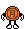 |  |
| sosad | `#[sosad]#mf` |  |  |
| good | `#good#mf` |  |  |
| hoho | `#hoho#mf` |  |  |
| kill | `#kill#mf` |  | 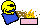 |
| bye | `#bye#mf` |  |  |
| z | `#Z_Z#mf` | 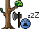 |  |
| @ | `#@_@#mf` |  |  |
| adore | `#adore#mf` | 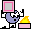 |  |
| wonder2 | `#???#mf` |  |  |
| banghead | `#[banghead]#mf` |  |  |
| bouncer | `#[bouncer]#mf` |  |  |
| bouncy | `#[bouncy]#mf` |  |  |
| offtopic | `#[offtopic]#mf` |  |  |
| censored | `#[censored]#mf` |  |  |
| flowerface | `#[flowerface]#mf` |  |  |
| shocking | `#[shocking]#mf` |  |  |
| photo | `#[photo]#mf` |  |  |
| fire | `#fire#mf` |  |  |
| yipes | `#[yipes]#mf` |  |  |
| 369 | `#[369]#mf` |  |  |
| bomb | `#[bomb]#mf` |  |  |
| slick | `#[slick]#mf` |  |  |
| fuck | `#fuck#mf` |  |  |
| no | `#no#mf` |  |  |
| kill2 | `#kill2#mf` | 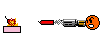 |  |
| special | `#:o)#mf #:)#mf` |  | 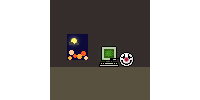 |
| special2 | `#:o)#mf #hoho#mf` |  | 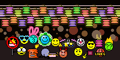 |
| special3 | `#:o)#mf #good#mf` | 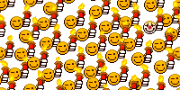 |  |
| special4 | `#:o)#mf #:-(#mf` |  |  |
| special5 | `#bye#mf #:)#mf` | 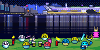 |  |
| special6 | `#[photo]#mf #:)#mf` |  |  |
| special7 | `#@_@#mf #:-[#mf` |  | 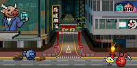 |
| special8 | `#ng#mf #cn#mf` | 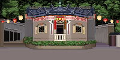 | 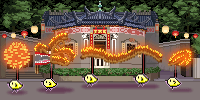 |

## normal [普通]
| Filename | Emoji | GIF | PNG |
| --- | --- | --- | --- |
| smile | `:)` |  |  |
| angel | `O:-)` |  |  |
| dead | `xx(` |  |  |
| clown | `:o)` |  |  |
| frown | `:-(` |  |  |
| cry | `:~(` |  |  |
| wink | `;-)` |  |  |
| angry | `:-[` |  |  |
| devil | `:-]` |  |  |
| biggrin | `:D` |  |  |
| oh | `:O` |  |  |
| tongue | `:P` |  |  |
| kiss | `^3^` |  |  |
| wonder | `?_?` |  |  |
| agree | `#yup#` | 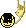 |  |
| donno | `#ng#` |  |  |
| hehe | `#hehe#` |  |  |
| love | `#love#` |  |  |
| surprise | `#oh#` |  |  |
| chicken | `#cn#` |  |  |
| ass | `#ass#` |  |  |
| sosad | `[sosad]` |  |  |
| good | `#good#` |  |  |
| hoho | `#hoho#` |  |  |
| kill | `#kill#` |  |  |
| bye | `#bye#` |  |  |
| z | `Z_Z` | 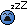 |  |
| @ | `@_@` |  |  |
| adore | `#adore#` |  |  |
| wonder2 | `#???#` |  |  |
| banghead | `[banghead]` |  |  |
| bouncer | `[bouncer]` |  | 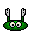 |
| bouncy | `[bouncy]` |  |  |
| offtopic | `[offtopic]` |  |  |
| censored | `[censored]` |  |  |
| flowerface | `[flowerface]` |  |  |
| shocking | `[shocking]` |  |  |
| photo | `[photo]` |  |  |
| fire | `#fire#` |  |  |
| yipes | `[yipes]` |  | 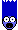 |
| 369 | `[369]` |  |  |
| bomb | `[bomb]` |  |  |
| slick | `[slick]` |  |  |
| fuck | `#fuck#` |  |  |
| no | `#no#` |  |  |
| kill2 | `#kill2#` |  |  |
| dislike | `#dislike#` |  |  |
| like | `#like#` |  |  |

## fifa [FIFA]

### Show On
From 2022-11-18T00:00:00+08:00

To 2022-12-20T00:00:00+08:00

| Filename | Emoji | GIF | PNG |
| --- | --- | --- | --- |
| smile | `#:)#fifa` |  |  |
| hoho | `#hoho#fifa` |  |  |
| photo | `#photo#fifa` |  |  |
| goal | `#goal#fifa` |  |  |
| dying | `#dying#fifa` |  |  |
| var | `#var#fifa` |  |  |
| devil | `#devil#fifa` |  |  |
| fuck | `#fuck#fifa` |  |  |
| red | `#red#fifa` |  |  |
| yellow | `#yellow#fifa` |  |  |
| no | `#no#fifa` |  |  |
| wonder | `#wonder#fifa` |  |  |
| wonder2 | `#wonder2#fifa` |  |  |
| goalkeeper | `#goalkeeper#fifa` |  |  |
| banghead | `#banghead#fifa` |  |  |
| slick | `#slick#fifa` |  |  |
| kill | `#kill#fifa` |  |  |
| kill2 | `#kill2#fifa` |  |  |
| frown | `#frown#fifa` |  |  |
| ass | `#ass#fifa` |  |  |
| ball | `#ball#fifa` |  |  |
| bouncer | `#bouncer#fifa` |  |  |
| bouncy | `#bouncy#fifa` |  |  |
| argentina | `#argentina#fifa` |  | 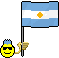 |
| australia | `#australia#fifa` |  |  |
| belgium | `#belgium#fifa` |  | 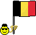 |
| brazil | `#brazil#fifa` |  |  |
| cameroon | `#cameroon#fifa` |  |  |
| canada | `#canada#fifa` |  |  |
| colombia | `#colombia#fifa` |  |  |
| costa_rica | `#costa_rica#fifa` |  |  |
| croatia | `#croatia#fifa` |  |  |
| denmark | `#denmark#fifa` |  |  |
| ecuador | `#ecuador#fifa` |  | 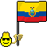 |
| egypt | `#egypt#fifa` |  |  |
| england | `#england#fifa` |  |  |
| france | `#france#fifa` |  |  |
| germany | `#germany#fifa` |  |  |
| ghana | `#ghana#fifa` |  |  |
| iceland | `#iceland#fifa` |  | 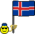 |
| iran | `#iran#fifa` |  |  |
| japan | `#japan#fifa` |  |  |
| mexico | `#mexico#fifa` |  |  |
| morocco | `#morocco#fifa` |  |  |
| netherlands | `#netherlands#fifa` |  |  |
| nigeria | `#nigeria#fifa` |  |  |
| panama | `#panama#fifa` |  |  |
| peru | `#peru#fifa` |  |  |
| poland | `#poland#fifa` |  |  |
| portugal | `#portugal#fifa` |  |  |
| qatar | `#qatar#fifa` |  |  |
| russia | `#russia#fifa` |  | 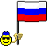 |
| saudi_arabia | `#saudi_arabia#fifa` |  |  |
| senegal | `#senegal#fifa` |  | 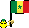 |
| serbia | `#serbia#fifa` |  |  |
| south_korea | `#south_korea#fifa` |  |  |
| spain | `#spain#fifa` |  |  |
| sweden | `#sweden#fifa` |  |  |
| switzerland | `#switzerland#fifa` |  |  |
| tunisia | `#tunisia#fifa` |  |  |
| usa | `#usa#fifa` |  |  |
| uruguay | `#uruguay#fifa` |  |  |
| wales | `#wales#fifa` |  |  |
| kill_connect | `#kill#fifa #slick#fifa` |  |  |
| kill2_connect | `#banghead#fifa #kill2#fifa` |  |  |

## dog [連狗]
| Filename | Emoji | GIF | PNG |
| --- | --- | --- | --- |
| smile | `#:)#dog` |  |  |
| hehe | `#hehe#dog` |  |  |
| haha | `#haha#dog` |  |  |
| bye | `#bye#dog` |  |  |
| 999 | `#999#dog` |  |  |
| on_hold | `#onhold#dog` |  |  |
| phone | `#phone#dog` |  |  |
| FBI | `#fbi#dog` |  |  |
| discover | `#discover#dog` |  |  |
| math | `#math#dog` | 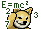 | 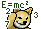 |
| photo | `#photo#dog` |  |  |
| telescope | `#telescope#dog` |  |  |
| excited | `#excited#dog` |  |  |
| lick | `#:P#dog` |  |  |
| tasty | `#tasty#dog` |  |  |
| wet | `#wet#dog` |  |  |
| touch | `#touch#dog` |  |  |
| play | `#play#dog` |  |  |
| treat | `#treat#dog` |  |  |
| injection | `#injection#dog` |  |  |
| clean | `#clean#dog` |  |  |
| stop | `#stop#dog` |  |  |
| no | `#no#dog` | 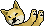 |  |
| realized | `#realized#dog` |  |  |
| scare | `#@_@#dog` |  |  |
| angry | `#:-[#dog` |  |  |
| zzz | `#zzz#dog` |  |  |
| upset | `#upset#dog` |  |  |
| notcry | `#notcry#dog` |  |  |
| cry | `#cry#dog` |  |  |
| cheerup | `#cheerup#dog` |  |  |
| give | `#give#dog` |  |  |
| beg | `#beg#dog` |  |  |
| itdog0 | `#it0#dog` |  |  |
| itdog1 | `#it1#dog` |  |  |
| itdog2 | `#it2#dog` |  |  |
| itdog3 | `#it3#dog` |  |  |
| itdog4 | `#it4#dog` |  |  |
| itdog5 | `#it5#dog` |  |  |
| run | `#run#dog` |  |  |
| bark | `#bark#dog` |  |  |
| escape | `#escape#dog` |  |  |
| beat | `#beat#dog` |  |  |
| fight1 | `#fight1#dog` |  |  |
| fight2 | `#fight2#dog` |  |  |
| fight3 | `#fight3#dog` |  |  |
| npc2 | `#npc2#dog` |  |  |
| lihkg | `#lihkg#dog` |  |  |
| beg_connect | `#give#dog #beg#dog` |  |  |
| fight_connect | `#fight1#dog #fight2#dog` |  |  |
| fight_connect2 | `#fight2#dog #fight1#dog` |  |  |
| fight_connect3 | `#fight1#dog #npc2#dog` |  |  |
| fight3_special | `#fight3#dog #fight3#dog #fight3#dog` |  |  |
| fight_special | `#fight1#dog #fight3#dog` |  |  |
| fight3_connect | `#power#cow #fight3#dog` |  |  |
| fight3_special2 | `#npc2#dog #fight3#dog` |  |  |

## pig [連豬]
| Filename | Emoji | GIF | PNG |
| --- | --- | --- | --- |
| smile | `#:)#pig` |  |  |
| hate | `#:[#pig` |  |  |
| smirk | `#:-]#pig` |  |  |
| hehe | `#hehe#pig` |  |  |
| mock | `#mock#pig` |  |  |
| clap | `#clap#pig` |  |  |
| sowhat | `#sowhat#pig` |  |  |
| bye | `#bye#pig` |  |  |
| cut | `#cut#pig` |  |  |
| cook | `#cooking#pig` |  |  |
| fry | `#fry#pig` |  |  |
| fan | `#fan#pig` |  |  |
| peanut | `#peanut#pig` |  |  |
| wine | `#wine#pig` |  |  |
| champagne | `#champagne#pig` |  |  |
| play | `#play#pig` |  |  |
| whip | `#whip#pig` |  |  |
| shocked | `#shocking#pig` |  |  |
| read | `#read#pig` |  |  |
| heard | `#heard#pig` |  |  |
| nope | `#nope#pig` |  |  |
| pointing | `#pointing#pig` |  |  |
| argue | `#argue#pig` |  |  |
| drum | `#drum#pig` |  |  |
| speakerphone | `#speakerphone#pig` |  |  |
| sad_n_angry | `#;-[#pig` |  |  |
| angry | `#:-[#pig` |  |  |
| knife | `#kill#pig` |  |  |
| arrested | `#arrested#pig` |  |  |
| upset | `#upset#pig` |  |  |
| wail | `#wail#pig` |  |  |
| wail2 | `#wail2#pig` |  |  |
| wail3 | `#wail3#pig` |  |  |
| sick | `#sick#pig` |  |  |
| dance | `#dance#pig` |  |  |
| dance2 | `#dance2#pig` |  |  |
| dance3 | `#dance3#pig` |  |  |
| dance4 | `#dance4#pig` |  |  |
| rolling | `#rolling#pig` |  |  |
| dying | `#dying#pig` |  |  |
| surviving | `#surviving#pig` |  |  |
| free | `#free#pig` |  |  |
| lihkg | `#lihkg#pig` |  |  |
| whip_special | `#play#pig #whip#pig` |  |  |
| whip_connect | `#whip#pig #fight2#dog` |  |  |
| knife_connect | `#fight1#dog #kill#pig` |  |  |
| cook_connect | `#cooking#pig #fan#pig` |  |  |
| wine_connect | `#wine#pig #champagne#pig` |  |  |

## horse [horse]
| Filename | Emoji | GIF | PNG |
| --- | --- | --- | --- |
| smile | `#smile#horse` |  |  |
| smile2 | `#smile2#horse` |  |  |
| smile3 | `#smile3#horse` |  |  |
| laugh | `#laugh#horse` |  |  |
| haha | `#haha#horse` |  |  |
| sosad | `#sosad#horse` |  |  |
| rose | `#rose#horse` |  |  |
| selfie | `#selfie#horse` |  |  |
| glasses | `#glasses#horse` |  |  |
| muscle | `#muscle#horse` |  |  |
| dance | `#dance#horse` |  |  |
| bye | `#bye#horse` |  |  |
| rope | `#rope#horse` |  |  |
| drink | `#drink#horse` |  |  |
| gone | `#gone#horse` |  |  |
| betting | `#betting#horse` |  |  |
| unicorn | `#unicorn#horse` |  |  |
| angry | `#angry#horse` |  |  |
| cry | `#cry#horse` |  |  |
| jeng | `#jeng#horse` |  |  |
| good | `#good#horse` |  |  |
| zero | `#zero#horse` |  |  |
| look | `#look#horse` |  |  |
| huh | `#huh#horse` |  |  |
| nah | `#nah#horse` |  |  |
| sad | `#sad#horse` |  |  |
| shock | `#shock#horse` |  |  |
| what | `#what#horse` |  |  |
| wtf | `#wtf#horse` |  |  |
| zzz | `#zzz#horse` |  |  |
| lihkg | `#lihkg#horse` |  |  |

## mouse [連鼠]
| Filename | Emoji | GIF | PNG |
| --- | --- | --- | --- |
| smile | `#:)#mouse` |  |  |
| pray | `#pray#mouse` |  |  |
| please | `#please#mouse` |  |  |
| miracle | `#miracle#mouse` |  |  |
| yea | `#yea#mouse` |  |  |
| ohyes | `#ohyes#mouse` |  |  |
| bye | `#bye#mouse` |  |  |
| fuck | `#fuck#mouse` |  |  |
| short | `#short#mouse` |  |  |
| there | `#there#mouse` |  |  |
| tea | `#tea#mouse` |  |  |
| cheer | `#cheer#mouse` |  |  |
| cheerleading | `#cheerleading#mouse` |  |  |
| love | `#love#mouse` |  |  |
| awake | `#awake#mouse` |  |  |
| vampire | `#vampire#mouse` |  |  |
| coffin | `#coffin#mouse` |  |  |
| cross | `#cross#mouse` |  |  |
| crystalball | `#crystalball#mouse` |  |  |
| potion | `#potion#mouse` |  |  |
| solution | `#solution#mouse` |  |  |
| gun | `#gun#mouse` |  |  |
| medicine | `#medicine#mouse` |  |  |
| how | `#how#mouse` |  |  |
| what | `#what#mouse` |  |  |
| scratching | `#scratching#mouse` |  |  |
| ohno | `#ohno#mouse` |  |  |
| notcry | `#notcry#mouse` |  |  |
| cry | `#cry#mouse` |  |  |
| cryalot | `#cryalot#mouse` |  |  |
| tired | `#tired#mouse` |  |  |
| blah | `#blah#mouse` |  |  |
| sigh | `#sigh#mouse` |  |  |
| annoyed | `#annoyed#mouse` |  |  |
| rubbish | `#rubbish#mouse` |  |  |
| wind | `#wind#mouse` |  |  |
| lihkg | `#lihkg#mouse` |  |  |
| smile_special | `#:)#mouse #stare#cat` |  |  |
| vampire_special | `#awake#mouse #vampire#mouse` |  |  |
| miracle_special | `#pray#mouse #please#mouse #miracle#mouse` |  |  |

## cat [連貓]
| Filename | Emoji | GIF | PNG |
| --- | --- | --- | --- |
| smile | `#:)#cat` |  |  |
| lick | `#:P#cat` |  |  |
| nap | `#nap#cat` |  |  |
| bye | `#bye#cat` |  |  |
| stare | `#stare#cat` |  |  |
| handup | `#handup#cat` |  |  |
| annoyed | `#annoyed#cat` |  |  |
| headache | `#headache#cat` |  |  |
| throw | `#throw#cat` |  |  |
| angry | `#:-[#cat` |  |  |
| appear | `#appear#cat` |  |  |
| darkness | `#darkness#cat` |  |  |
| threat | `#threat#cat` |  |  |
| swipe | `#swipe#cat` |  |  |
| rain | `#rain#cat` |  |  |
| shaking | `#shaking#cat` |  |  |
| sneeze | `#sneeze#cat` |  |  |
| mask | `#mask#cat` |  |  |
| unwell | `#xx(#cat` |  |  |
| disappointed | `#disappointed#cat` |  |  |
| angel | `#O:-)#cat` |  |  |
| pussy1 | `#pussy1#cat` |  |  |
| pussy2 | `#pussy2#cat` |  |  |
| stretching | `#stretching#cat` |  |  |
| lucky | `#lucky#cat` |  |  |
| lihkg | `#lihkg#cat` |  |  |
| throw_connect | `#throw#cat #beg#dog` |  |  |

## cow [連牛]
| Filename | Emoji | GIF | PNG |
| --- | --- | --- | --- |
| smile | `#:)#cow` |  |  |
| hehe | `#hehe#cow` |  |  |
| sad | `#sad#cow` |  |  |
| sosad | `#sosad#cow` |  |  |
| sweat | `#sweat#cow` |  |  |
| bye | `#bye#cow` |  |  |
| hair | `#hair#cow` |  |  |
| slap | `#slap#cow` |  |  |
| geltau | `#geltau#cow` |  |  |
| sadbutsmile | `#sadbutsmile#cow` |  |  |
| door | `#door#cow` |  |  |
| grab | `#grab#cow` |  |  |
| no | `#no#cow` |  |  |
| sleep | `#sleep#cow` |  |  |
| plan | `#plan#cow` |  |  |
| scheme | `#scheme#cow` |  |  |
| arrogant | `#arrogant#cow` |  |  |
| cigar | `#cigar#cow` |  |  |
| wa | `#wa#cow` |  |  |
| unexpected | `#unexpected#cow` |  |  |
| ball | `#ball#cow` |  |  |
| lose | `#lose#cow` |  |  |
| medal | `#medal#cow` |  |  |
| gold | `#gold#cow` |  |  |
| power | `#power#cow` |  |  |
| sorry | `#sorry#cow` |  |  |
| arrr | `#arrr#cow` |  |  |
| crowd | `#crowd#cow` |  |  |
| bus | `#bus#cow` |  |  |
| bicycle | `#bicycle#cow` |  |  |
| car | `#car#cow` |  |  |
| linguistic | `#linguistic#cow` |  |  |
| lihkg | `#lihkg#cow` |  |  |
| power_special | `#gold#cow #power#cow` |  |  |
| bus_special | `#crowd#cow #bus#cow` |  |  |
| grab_connect | `#grab#cow #beg#dog` |  |  |

## tiger [連虎]
| Filename | Emoji | GIF | PNG |
| --- | --- | --- | --- |
| smile | `#:)#tiger` |  |  |
| happy | `#happy#tiger` |  |  |
| slap | `#slap#tiger` |  |  |
| bye | `#bye#tiger` |  |  |
| hello | `#hello#tiger` |  |  |
| glasses | `#glasses#tiger` |  |  |
| money | `#money#tiger` |  |  |
| sad | `#sad#tiger` |  |  |
| sweat | `#sweat#tiger` |  |  |
| donno | `#donno#tiger` |  |  |
| no | `#no#tiger` |  |  |
| angry | `#angry#tiger` |  |  |
| fire | `#fire#tiger` |  |  |
| oh | `#oh#tiger` |  |  |
| nlhg | `#nlhg#tiger` |  |  |
| pcr | `#pcr#tiger` |  |  |
| popcorn | `#popcorn#tiger` |  |  |
| champagne | `#champagne#tiger` |  |  |
| lieflat | `#lieflat#tiger` |  |  |
| like | `#like#tiger` |  |  |
| like2 | `#like2#tiger` |  |  |
| punchbag | `#punchbag#tiger` |  |  |
| fencing | `#fencing#tiger` |  |  |
| rpg7 | `#rpg7#tiger` |  |  |
| lihkg | `#lihkg#tiger` |  |  |
| lihkg2 | `#lihkg2#tiger` |  |  |
| fire_special | `#angry#tiger #fire#tiger` |  |  |
| sad_special | `#sad#tiger #happy#tiger` |  |  |
| shock_special | `#oh#tiger #nlhg#tiger` |  |  |
| like_special | `#like#tiger #like#tiger` |  |  |
| punch_special | `#punchbag#tiger #angry#tiger` |  |  |
| punchbag_connect | `#punchbag#tiger #fight2#dog` |  |  |
| fencing_connect | `#fencing#tiger #annoyed#cat` |  |  |
| fencing_connect2 | `#fencing#tiger #knife#pig` |  |  |

## rabbit [連兔]
| Filename | Emoji | GIF | PNG |
| --- | --- | --- | --- |
| smile | `#:)#rabbit` |  |  |
| smile2 | `#smile2#rabbit` |  |  |
| smile3 | `#smile3#rabbit` |  |  |
| happy | `#happy#rabbit` |  |  |
| haha | `#haha#rabbit` |  |  |
| clap | `#clap#rabbit` |  |  |
| agree | `#agree#rabbit` |  |  |
| music | `#music#rabbit` |  |  |
| bye | `#bye#rabbit` |  |  |
| blink | `#blink#rabbit` |  |  |
| hear | `#hear#rabbit` |  |  |
| confuse | `#confuse#rabbit` |  |  |
| wtf | `#wtf#rabbit` |  |  |
| angry | `#:-[#rabbit` |  |  |
| axe | `#axe#rabbit` |  |  |
| banghead | `#banghead#rabbit` |  |  |
| orange | `#orange#rabbit` |  |  |
| emo | `#emo#rabbit` |  |  |
| dance | `#dance#rabbit` |  |  |
| sweat | `#sweat#rabbit` |  |  |
| trauma | `#trauma#rabbit` |  |  |
| sad | `#sad#rabbit` |  |  |
| creepy | `#creepy#rabbit` |  |  |
| scary | `#scary#rabbit` |  |  |
| drink | `#drink#rabbit` |  |  |
| eat | `#eat#rabbit` |  |  |
| saw | `#saw#rabbit` |  |  |
| stun | `#stun#rabbit` |  |  |
| tape | `#tape#rabbit` |  |  |
| badboy | `#badboy#rabbit` |  |  |
| yawn | `#yawn#rabbit` |  |  |
| fly | `#fly#rabbit` |  |  |
| lihkg | `#lihkg#rabbit` |  |  |
| clap_special | `#clap#rabbit #creepy#rabbit` |  |  |
| eat_connect | `#eat#rabbit #eating#lm2` |  |  |
| hammer_connect | `#it3#dog #axe#rabbit` |  |  |
| lihkg_special | `#saw#rabbit #lihkg#rabbit` |  |  |
| roast_connect | `#cooking#pig #:)#rabbit` |  |  |
| roast_special | `#:)#rabbit #cooking#pig` |  |  |
| axe_connect | `#car#cow #axe#rabbit` |  |  |

## dragon [連龍]
| Filename | Emoji | GIF | PNG |
| --- | --- | --- | --- |
| smile | `#:)#dragon` |  |  |
| happy | `#:D#dragon` |  |  |
| unclehappy | `#unclehappy#dragon` |  |  |
| unclehappy2 | `#unclehappy2#dragon` |  |  |
| lick | `#lick#dragon` |  |  |
| lick2 | `#lick2#dragon` |  |  |
| gj | `#gj#dragon` |  |  |
| disappear | `#disappear#dragon` |  |  |
| guitar | `#guitar#dragon` |  |  |
| bye | `#bye#dragon` |  |  |
| eat | `#eat#dragon` |  |  |
| ok | `#ok#dragon` |  |  |
| drink | `#drink#dragon` |  |  |
| think | `#think#dragon` |  |  |
| wtf | `#wtf#dragon` |  |  |
| phone | `#phone#dragon` |  |  |
| ngg | `#ngg#dragon` |  |  |
| mindblown | `#mindblown#dragon` |  |  |
| wheelchair | `#wheelchair#dragon` |  |  |
| angry | `#:-[#dragon` |  |  |
| headache | `#headache#dragon` |  |  |
| spit | `#spit#dragon` |  |  |
| midfinger | `#midfinger#dragon` |  |  |
| laser | `#laser#dragon` |  |  |
| read | `#read#dragon` |  |  |
| sad | `#sad#dragon` |  |  |
| sad2 | `#sad2#dragon` |  |  |
| nope | `#nope#dragon` |  |  |
| shock | `#shock#dragon` |  |  |
| backpain | `#backpain#dragon` |  |  |
| shiver | `#shiver#dragon` |  |  |
| z | `#z#dragon` |  |  |
| wind | `#wind#dragon` |  |  |
| lihkg | `#lihkg#dragon` |  |  |
| angry_connect | `#spit#dragon #gun#mouse` |  |  |
| angry_connect2 | `#:-[#dragon #tired#mouse` |  |  |
| angry_special | `#:-[#dragon #midfinger#dragon` |  |  |
| backpain_connect | `#throw#cat #backpain#dragon` |  |  |
| wheelchair_connect | `#car#cow #wheelchair#dragon` |  |  |

## snake [snake]
| Filename | Emoji | GIF | PNG |
| --- | --- | --- | --- |
| smile | `#:)#snake` |  |  |
| laugh | `#:D#snake` |  |  |
| nose | `#nose#snake` |  |  |
| want | `#want#snake` |  |  |
| knife | `#knife#snake` |  |  |
| shotgun | `#shotgun#snake` |  |  |
| explosion | `#explosion#snake` |  |  |
| sweat | `#sweat#snake` |  |  |
| write | `#write#snake` |  |  |
| confuse | `#confuse#snake` |  |  |
| wtf | `#wtf#snake` |  |  |
| scream | `#scream#snake` |  |  |
| shock | `#shock#snake` |  |  |
| wow | `#wow#snake` |  |  |
| boring | `#boring#snake` |  |  |
| sad | `#sad#snake` |  |  |
| sad2 | `#sad2#snake` |  |  |
| bye | `#bye#snake` |  |  |
| eat | `#eat#snake` |  |  |
| drink | `#drink#snake` |  |  |
| think | `#think#snake` |  |  |
| hypnosis | `#hypnosis#snake` |  |  |
| arcade | `#arcade#snake` |  |  |
| sign | `#sign#snake` |  |  |
| zzz | `#zzz#snake` |  |  |
| lihkg | `#lihkg#snake` |  |  |
| hypnosis_connect | `#hypnosis#snake #awake#mouse` |  |  |
| knife_connect | `#knife#snake #stun#rabbit` |  |  |
| shotgun_special | `#shotgun#snake #shotgun#snake #shotgun#snake` |  |  |
| scream_connect | `#music#rabbit #scream#snake` |  |  |
| eat_special | `#eat#snake #wtf#snake` |  |  |

## lm2 [腦魔2]
| Filename | Emoji | GIF | PNG |
| --- | --- | --- | --- |
| smile | `#:)#lm2` |  |  |
| clown | `#:o)#lm2` |  |  |
| kill | `#kill#lm2` |  |  |
| shield | `#shield#lm2` |  |  |
| bye | `#bye#lm2` |  |  |
| eating | `#eating#lm2` |  |  |
| yo | `#yo#lm2` |  |  |
| sosick | `#[sosick]#lm2` |  |  |
| mask | `#mask#lm2` |  |  |
| doubt | `#doubt#lm2` |  |  |
| diu | `#diu#lm2` |  |  |
| touch | `#touch#lm2` |  |  |
| wet | `#wet#lm2` |  |  |
| jable | `#jable#lm2` |  |  |
| tongue | `#:P#lm2` |  |  |
| tongue2 | `#tongue2#lm2` |  |  |
| tongue3 | `#tongue3#lm2` |  |  |
| tongue4 | `#tongue4#lm2` |  |  |
| heyhey | `#heyhey#lm2` |  |  |
| lick | `#lick#lm2` |  |  |
| spinning | `#spinning#lm2` |  |  |
| spinning2 | `#spinning2#lm2` |  |  |
| bouncer | `#[bouncer]#lm2` |  |  |
| huh | `#huh#lm2` |  |  |
| dead | `#xx(#lm2` |  |  |
| wonder2 | `#???#lm2` |  |  |
| wfc2 | `#wfc2#lm2` |  |  |
| support | `#support#lm2` |  |  |
| sosad | `#[sosad]#lm2` |  |  |
| haha | `#haha#lm2` |  |  |
| nosee | `#nosee#lm2` |  |  |
| sosad2 | `#sosad2#lm2` |  |  |
| haha2 | `#haha2#lm2` |  |  |
| hoho | `#hoho#lm2` |  |  |
| aha | `#aha#lm2` |  |  |
| squint | `#squint#lm2` |  |  |
| love | `#love#lm2` |  |  |
| chu | `#chu#lm2` |  |  |
| hehe | `#hehe#lm2` |  |  |
| hehe2 | `#hehe2#lm2` |  |  |
| photo | `#[photo]#lm2` |  |  |
| point1 | `#point1#lm2` |  |  |
| point2 | `#point2#lm2` |  |  |
| beer | `#beer#lm2` |  |  |
| agree | `#yup#lm2` |  |  |
| slick | `#[slick]#lm2` |  |  |
| yeah | `#yeah#lm2` |  |  |
| donno | `#ng#lm2` |  |  |
| no | `#no#lm2` |  |  |
| brain | `#brain#lm2` |  |  |
| shock | `#shock#lm2` |  |  |
| fear | `#fear#lm2` |  |  |
| oh | `#:O#lm2` |  |  |
| bang | `#bang#lm2` |  |  |
| silly | `#silly#lm2` |  |  |
| 369 | `#[369]#lm2` |  |  |
| dllm | `#dllm#lm2` |  |  |
| what | `#what#lm2` |  |  |
| fuck | `#fuck#lm2` |  |  |
| bomb2 | `#[bomb2]#lm2` |  |  |
| bomb | `#[bomb]#lm2` |  |  |
| shoot | `#shoot#lm2` |  |  |
| hate | `#hate#lm2` |  |  |
| angry | `#:-[#lm2` |  |  |
| angry2 | `#angry2#lm2` |  |  |
| aura | `#aura#lm2` |  |  |
| saber | `#saber#lm2` |  |  |
| punch | `#punch#lm2` |  |  |
| danger | `#danger#lm2` |  |  |
| dislike | `#dislike#lm2` |  |  |
| good | `#good#lm2` |  |  |
| ok | `#ok#lm2` |  |  |
| go | `#go#lm2` |  |  |
| drop | `#drop#lm2` |  |  |
| rise | `#rise#lm2` |  |  |
| wfc | `#wfc#lm2` |  |  |
| think | `#think#lm2` |  |  |
| eh | `#eh#lm2` |  |  |
| bandage | `#bandage#lm2` |  |  |
| adore | `#adore#lm2` |  |  |
| kiss2 | `#^3^#lm2` |  |  |
| kiss | `#kiss#lm2` |  |  |
| nothing | `#nothing#lm2` |  |  |
| flowerface | `#[flowerface]#lm2` |  |  |
| muscle | `#muscle#lm2` |  |  |
| sad | `#sad#lm2` |  |  |
| tear | `#tear#lm2` |  |  |
| frown | `#:-(#lm2` |  |  |
| frownsmile | `#frownsmile#lm2` |  |  |
| angelsmile | `#angelsmile#lm2` |  |  |
| z | `#Z_Z#lm2` |  |  |
| noodles | `#noodles#lm2` |  |  |
| stare | `#stare#lm2` |  |  |
| lightbulb | `#lightbulb#lm2` |  |  |
| abomb | `#[abomb]#lm2` |  |  |
| selfdestruct | `#selfdestruct#lm2` |  |  |
| shocking | `#[shocking]#lm2` |  |  |
| @ | `#@_@#lm2` |  |  |
| yipes | `#[yipes]#lm2` |  |  |
| uggh | `#uggh#lm2` |  |  |
| cry | `#:~(#lm2` |  |  |
| dust | `#dust#lm2` |  |  |
| burnt | `#burnt#lm2` |  |  |
| evil | `#evil#lm2` |  |  |
| ghost | `#ghost#lm2` |  |  |
| credit | `#credit#lm2` |  |  |

## lm2lny [腦魔2新年版]

### Show On
From 2026-02-16T23:59:59+08:00

To 2026-02-26T00:00:00+08:00

| Filename | Emoji | GIF | PNG |
| --- | --- | --- | --- |
| smile | `#:)#lm2lny` |  |  |
| clown | `#:o)#lm2lny` |  |  |
| kill | `#kill#lm2lny` |  |  |
| shield | `#shield#lm2lny` |  |  |
| bye | `#bye#lm2lny` |  |  |
| eating | `#eating#lm2lny` |  |  |
| yo | `#yo#lm2lny` |  |  |
| sosick | `#[sosick]#lm2lny` |  |  |
| mask | `#mask#lm2lny` |  |  |
| diu | `#diu#lm2lny` |  |  |
| touch | `#touch#lm2lny` |  |  |
| wet | `#wet#lm2lny` |  |  |
| jable | `#jable#lm2lny` |  |  |
| tongue | `#:P#lm2lny` |  |  |
| lick | `#lick#lm2lny` |  |  |
| spinning | `#spinning#lm2lny` |  |  |
| spinning2 | `#spinning2#lm2lny` |  |  |
| bouncer | `#[bouncer]#lm2lny` |  |  |
| dead | `#xx(#lm2lny` |  |  |
| wonder2 | `#???#lm2lny` |  |  |
| wfc2 | `#wfc2#lm2lny` |  |  |
| support | `#support#lm2lny` |  |  |
| sosad | `#[sosad]#lm2lny` |  |  |
| haha | `#haha#lm2lny` |  |  |
| nosee | `#nosee#lm2lny` |  |  |
| hoho | `#hoho#lm2lny` |  |  |
| love | `#love#lm2lny` |  |  |
| hehe | `#hehe#lm2lny` |  |  |
| photo | `#[photo]#lm2lny` |  |  |
| point1 | `#point1#lm2lny` |  |  |
| point2 | `#point2#lm2lny` |  |  |
| beer | `#beer#lm2lny` |  |  |
| agree | `#yup#lm2lny` |  |  |
| slick | `#[slick]#lm2lny` |  |  |
| yeah | `#yeah#lm2lny` |  |  |
| donno | `#ng#lm2lny` |  |  |
| no | `#no#lm2lny` |  |  |
| brain | `#brain#lm2lny` |  |  |
| oh | `#:O#lm2lny` |  |  |
| bang | `#bang#lm2lny` |  |  |
| silly | `#silly#lm2lny` |  |  |
| 369 | `#[369]#lm2lny` |  |  |
| dllm | `#dllm#lm2lny` |  |  |
| fuck | `#fuck#lm2lny` |  |  |
| bomb2 | `#[bomb2]#lm2lny` |  |  |
| bomb | `#[bomb]#lm2lny` |  |  |
| shoot | `#shoot#lm2lny` |  |  |
| hate | `#hate#lm2lny` |  |  |
| angry | `#:-[#lm2lny` |  |  |
| aura | `#aura#lm2lny` |  |  |
| saber | `#saber#lm2lny` |  |  |
| danger | `#danger#lm2lny` |  |  |
| dislike | `#dislike#lm2lny` |  |  |
| good | `#good#lm2lny` |  |  |
| ok | `#ok#lm2lny` |  |  |
| go | `#go#lm2lny` |  |  |
| drop | `#drop#lm2lny` |  |  |
| rise | `#rise#lm2lny` |  |  |
| wfc | `#wfc#lm2lny` |  |  |
| think | `#think#lm2lny` |  |  |
| adore | `#adore#lm2lny` |  |  |
| kiss2 | `#^3^#lm2lny` |  |  |
| kiss | `#kiss#lm2lny` |  |  |
| nothing | `#nothing#lm2lny` |  |  |
| flowerface | `#[flowerface]#lm2lny` |  |  |
| frown | `#:-(#lm2lny` |  |  |
| frownsmile | `#frownsmile#lm2lny` |  |  |
| z | `#Z_Z#lm2lny` |  |  |
| noodles | `#noodles#lm2lny` |  |  |
| lightbulb | `#lightbulb#lm2lny` |  |  |
| abomb | `#[abomb]#lm2lny` |  |  |
| selfdestruct | `#selfdestruct#lm2lny` |  |  |
| shocking | `#[shocking]#lm2lny` |  |  |
| @ | `#@_@#lm2lny` |  |  |
| yipes | `#[yipes]#lm2lny` |  |  |
| cry | `#:~(#lm2lny` |  |  |
| dust | `#dust#lm2lny` |  |  |
| credit | `#credit#lm2lny` |  |  |

## fs [FS]
| Filename | Emoji | GIF | PNG |
| --- | --- | --- | --- |
| smile | `#:)#fs` |  |  |
| angel | `#O:-)#fs` |  |  |
| dead | `#xx(#fs` |  |  |
| clown | `#:o)#fs` |  |  |
| wink | `#;-)#fs` |  |  |
| angry | `#:-[#fs` |  |  |
| devil | `#:-]#fs` |  |  |
| biggrin | `#:D#fs` |  |  |
| oh | `#:O#fs` |  |  |
| tongue | `#:P#fs` |  |  |
| kiss | `#^3^#fs` |  |  |
| wonder | `#?_?#fs` |  |  |
| agree | `#yup#fs` |  |  |
| love | `#love#fs` |  |  |
| chicken | `#cn#fs` |  |  |
| sosad | `#[sosad]#fs` |  |  |
| good | `#good#fs` |  |  |
| hoho | `#hoho#fs` |  |  |
| kill | `#kill#fs` |  |  |
| bye | `#bye#fs` |  |  |
| adore | `#adore#fs` |  |  |
| wonder2 | `#???#fs` |  |  |
| bouncer | `#[bouncer]#fs` |  |  |
| bouncy | `#[bouncy]#fs` |  |  |
| offtopic | `#[offtopic]#fs` |  |  |
| censored | `#[censored]#fs` |  |  |
| flowerface | `#[flowerface]#fs` |  |  |
| shocking | `#[shocking]#fs` |  |  |
| 369 | `#[369]#fs` |  |  |
| bomb | `#[bomb]#fs` |  |  |
| fuck | `#fuck#fs` |  |  |
| no | `#no#fs` |  |  |
| kill2 | `#kill2#fs` |  |  |
| battle | `#battle#fs` |  |  |
| south_bear | `#bear#fs` |  |  |
| want_die | `#die#fs` |  |  |
| fozen_smile | `#:)#ice#fs` |  |  |
| green_cap | `#gcap#fs` |  |  |
| green_cap_2 | `#gcap2#fs` |  |  |
| green_cap_3 | `#gcap3#fs` |  |  |
| jj | `#jj#fs` |  |  |
| lomore_hoho | `#hoho#lm#fs` |  |  |
| lomore_kill | `#kill#lm#fs` |  |  |
| lomore_smile | `#:)#lm#fs` |  |  |
| poison | `#poison#fs` |  |  |
| pokemon_1 | `#poke1#fs` |  |  |
| pokemon_2 | `#poke2#fs` |  |  |
| superman | `#superman#fs` |  |  |

## big [普通]

### Show On
From 1970-01-01T08:00:00+08:00

To 1970-01-01T08:00:00+08:00

| Filename | Emoji | GIF | PNG |
| --- | --- | --- | --- |
| smile | `#:)#b` |  |  |
| angel | `#O:-)#b` |  |  |
| dead | `#xx(#b` |  |  |
| clown | `#:o)#b` |  |  |
| frown | `#:-(#b` |  |  |
| cry | `#:~(#b` |  |  |
| wink | `#;-)#b` |  |  |
| angry | `#:-[#b` |  |  |
| devil | `#:-]#b` |  |  |
| biggrin | `#:D#b` |  |  |
| oh | `#:O#b` |  |  |
| tongue | `#:P#b` |  |  |
| kiss | `#^3^#b` |  |  |
| wonder | `#?_?#b` |  |  |
| agree | `#yup#b` |  |  |
| donno | `#ng#b` |  |  |
| hehe | `#hehe#b` |  |  |
| love | `#love#b` |  |  |
| surprise | `#oh#b` |  |  |
| chicken | `#cn#b` |  |  |
| ass | `#ass#b` |  |  |
| sosad | `#[sosad]#b` |  |  |
| good | `#good#b` |  |  |
| hoho | `#hoho#b` |  |  |
| kill | `#kill#b` |  |  |
| bye | `#bye#b` |  |  |
| z | `#Z_Z#b` |  |  |
| @ | `#@_@#b` |  |  |
| adore | `#adore#b` |  |  |
| wonder2 | `#???#b` |  |  |
| banghead | `#[banghead]#b` |  |  |
| bouncer | `#[bouncer]#b` |  |  |
| bouncy | `#[bouncy]#b` |  |  |
| offtopic | `#[offtopic]#b` |  |  |
| censored | `#[censored]#b` |  |  |
| flowerface | `#[flowerface]#b` |  |  |
| shocking | `#[shocking]#b` |  |  |
| photo | `#[photo]#b` |  |  |
| fire | `#fire#b` |  |  |
| yipes | `#[yipes]#b` |  |  |
| 369 | `#[369]#b` |  |  |
| bomb | `#[bomb]#b` |  |  |
| slick | `#[slick]#b` |  |  |
| fuck | `#fuck#b` |  |  |
| no | `#no#b` |  |  |
| kill2 | `#kill2#b` |  |  |
| like | `#like#b` |  |  |
| dislike | `#dislike#b` |  |  |
| lomore_agree | `#yup#lm#b` |  |  |
| lomore_bouncer | `#bouncer#lm#b` |  |  |
| lomore_bye | `#bye#lm#b` |  |  |
| lomore_shocking | `#shocking#lm#b` |  |  |

## lomoji [腦魔Moji]

### Show On
From 1970-01-01T08:00:00+08:00

To 1970-01-01T08:00:00+08:00

| Filename | Emoji | GIF | PNG |
| --- | --- | --- | --- |
| 05 | `#:)#lme` |  |  |
| 01 | `#mad#lme` |  |  |
| 02 | `#unamused#lme` |  |  |
| 03 | `#:-]#lme` |  |  |
| 04 | `#smirking#lme` |  |  |
| 06 | `#happy#lme` |  |  |
| 07 | `#^3^#lme` |  |  |
| 08 | `#:P#lme` |  |  |
| 09 | `#love#lme` |  |  |
| 10 | `#hoho#lme` |  |  |
| 11 | `#tongue1#lme` |  |  |
| 12 | `#tongue2#lme` |  |  |
| 13 | `#tongue3#lme` |  |  |
| 14 | `#wink#lme` |  |  |
| 15 | `#ghost#lme` |  |  |
| 16 | `#sad#lme` |  |  |
| 17 | `#sleepy#lme` |  |  |
| 18 | `#O:-)#lme` |  |  |
| 19 | `#:(#lme` |  |  |
| 20 | `#pain#lme` |  |  |
| 21 | `#tired#lme` |  |  |
| 22 | `#cry#lme` |  |  |
| 23 | `#bawling#lme` |  |  |
| 24 | `#scream#lme` |  |  |
| 25 | `#shame#lme` |  |  |
| 26 | `#think#lme` |  |  |
| 27 | `#sick#lme` |  |  |
| 28 | `#shy#lme` |  |  |
| 29 | `#devil#lme` |  |  |
| 30 | `#dizzy#lme` |  |  |
| 31 | `#scared#lme` |  |  |
| 32 | `#nervous#lme` |  |  |
| 33 | `#angry#lme` |  |  |
| 34 | `#ok#lme` |  |  |
| 35 | `#yeah#lme` |  |  |
| 36 | `#yo#lme` |  |  |
| 37 | `#sosad#lme` |  |  |
| 38 | `#addoil#lme` |  |  |
| 39 | `#wound#lme` |  |  |
| 40 | `#wfc#lme` |  |  |
| 41 | `#shock#lme` |  |  |
| 42 | `#:-)#lme` |  |  |

## fatc [fatc]

### Show On
User ID: 21423, 45173

| Filename | Emoji | GIF | PNG |
| --- | --- | --- | --- |
| fat001 | `#:)#fatc` |  |  |
| fat002 | `#O:-)#fatc` |  |  |
| fat003 | `#xx(#fatc` |  |  |
| fat004 | `#:o)#fatc` |  |  |
| fat005 | `#:-(#fatc` |  |  |
| fat006 | `#:~(#fatc` |  |  |
| fat007 | `#;-)#fatc` |  |  |
| fat008 | `#:-[#fatc` |  |  |
| fat009 | `#:-]#fatc` |  |  |
| fat010 | `#:D#fatc` |  |  |
| fat011 | `#:O#fatc` |  |  |
| fat012 | `#:P#fatc` |  |  |
| fat013 | `#^3^#fatc` |  |  |
| fat014 | `#?_?#fatc` |  |  |
| fat015 | `#yup#fatc` |  |  |
| fat016 | `#ng#fatc` |  |  |
| fat017 | `#hehe#fatc` |  |  |
| fat018 | `#love#fatc` |  |  |
| fat019 | `#oh#fatc` |  |  |
| fat020 | `#cn#fatc` |  |  |
| fat021 | `#ass#fatc` |  |  |
| fat022 | `#[sosad]#fatc` |  |  |
| fat023 | `#good#fatc` |  |  |
| fat024 | `#hoho#fatc` |  |  |
| fat025 | `#kill#fatc` |  |  |
| fat026 | `#bye#fatc` |  |  |
| fat027 | `#Z_Z#fatc` |  |  |
| fat028 | `#@_@#fatc` |  |  |
| fat029 | `#adore#fatc` |  |  |
| fat030 | `#???#fatc` |  |  |
| fat031 | `#[banghead]#fatc` |  |  |
| fat032 | `#[bouncer]#fatc` |  |  |
| fat033 | `#[bouncy]#fatc` |  |  |
| fat034 | `#[offtopic]#fatc` |  |  |
| fat035 | `#[censored]#fatc` |  |  |
| fat036 | `#[flowerface]#fatc` |  |  |
| fat037 | `#[shocking]#fatc` |  |  |
| fat038 | `#[photo]#fatc` |  |  |
| fat039 | `#fire#fatc` |  |  |
| fat040 | `#[yipes]#fatc` |  |  |
| fat041 | `#[369]#fatc` |  |  |
| fat042 | `#[bomb]#fatc` |  |  |
| fat043 | `#[slick]#fatc` |  |  |
| fat044 | `#fuck#fatc` |  |  |
| fat045 | `#no#fatc` |  |  |
| fat046 | `#kill2#fatc` |  |  |
| fat047 | `#like#fatc` |  |  |
| fat048 | `#dislike#fatc` |  |  |
| fat049 | `#[joyce]#fatc` |  |  |

## husky [husky]

### Show On
From 1970-01-01T08:00:00+08:00

To 1970-01-01T08:00:00+08:00

| Filename | Emoji | GIF | PNG |
| --- | --- | --- | --- |
| smile | `#:)#husky` |  |  |
| hehe | `#hehe#husky` |  |  |
| haha | `#haha#husky` |  |  |
| bye | `#bye#husky` |  |  |
| 999 | `#999#husky` |  |  |
| FBI | `#fbi#husky` |  |  |
| lick | `#:P#husky` |  |  |
| wet | `#wet#husky` |  |  |
| touch | `#touch#husky` |  |  |
| no | `#no#husky` |  |  |
| scare | `#@_@#husky` |  |  |
| angry | `#:-[#husky` |  |  |
| zzz | `#zzz#husky` |  |  |
| cry | `#cry#husky` |  |  |
| give | `#give#husky` |  |  |
| beg | `#beg#husky` |  |  |
| itdog1 | `#it1#husky` |  |  |
| itdog2 | `#it2#husky` |  |  |
| run | `#run#husky` |  |  |
| beat | `#beat#husky` |  |  |
| fight1 | `#fight1#husky` |  |  |
| fight2 | `#fight2#husky` |  |  |
| lihkg | `#lihkg#husky` |  |  |
| beg_connect | `#give#husky #beg#husky` |  |  |
| beg_connect_AB | `#give#dog #beg#husky` |  |  |
| beg_connect_BA | `#give#husky #beg#dog` |  |  |
| fight_connect | `#fight1#husky #fight2#husky` |  |  |
| fight_connect_AB | `#fight1#dog #fight2#husky` |  |  |
| fight_connect_BA | `#fight1#husky #fight2#dog` |  |  |

