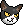
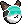

## cat [連貓]
| Filename | Emoji | GIF | PNG |
| --- | --- | --- | --- |
| smile | `#:)#cat` |  |  |
| lick | `#:P#cat` |  |  |
| nap | `#nap#cat` |  |  |
| bye | `#bye#cat` |  |  |
| stare | `#stare#cat` |  |  |
| handup | `#handup#cat` |  |  |
| annoyed | `#annoyed#cat` |  |  |
| headache | `#headache#cat` |  |  |
| throw | `#throw#cat` |  |  |
| angry | `#:-[#cat` |  |  |
| appear | `#appear#cat` |  |  |
| darkness | `#darkness#cat` |  |  |
| threat | `#threat#cat` |  |  |
| swipe | `#swipe#cat` |  |  |
| rain | `#rain#cat` |  |  |
| shaking | `#shaking#cat` |  |  |
| sneeze | `#sneeze#cat` |  |  |
| mask | `#mask#cat` |  |  |
| unwell | `#xx(#cat` |  |  |
| disappointed | `#disappointed#cat` |  |  |
| angel | `#O:-)#cat` |  |  |
| pussy1 | `#pussy1#cat` |  |  |
| pussy2 | `#pussy2#cat` |  |  |
| stretching | `#stretching#cat` |  |  |
| lucky | `#lucky#cat` |  |  |
| lihkg | `#lihkg#cat` |  |  |
| throw_connect | `#throw#cat #beg#dog` |  |  |

