## fifa [FIFA]

### Show On
From 2026-06-12T00:00:00+08:00

To 2026-07-22T00:00:00+08:00

| Filename | Emoji | GIF | PNG |
| --- | --- | --- | --- |
| smile | `#:)#fifa` |  |  |
| hoho | `#hoho#fifa` |  |  |
| photo | `#photo#fifa` |  |  |
| goal | `#goal#fifa` |  |  |
| dying | `#dying#fifa` |  |  |
| var | `#var#fifa` | 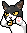 | 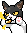 |
| devil | `#devil#fifa` | 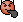 | 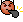 |
| fuck | `#fuck#fifa` |  |  |
| red | `#red#fifa` |  |  |
| yellow | `#yellow#fifa` |  |  |
| no | `#no#fifa` |  |  |
| wonder | `#wonder#fifa` |  |  |
| wonder2 | `#wonder2#fifa` |  |  |
| goalkeeper | `#goalkeeper#fifa` |  |  |
| banghead | `#banghead#fifa` |  |  |
| slick | `#slick#fifa` |  |  |
| kill | `#kill#fifa` |  |  |
| kill2 | `#kill2#fifa` | 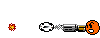 | 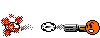 |
| frown | `#frown#fifa` |  |  |
| ass | `#ass#fifa` | 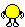 |  |
| ball | `#ball#fifa` |  |  |
| bouncer | `#bouncer#fifa` |  |  |
| bouncy | `#bouncy#fifa` |  |  |
| algeria | `#algeria#fifa` | 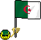 | 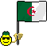 |
| argentina | `#argentina#fifa` | 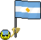 | 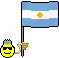 |
| australia | `#australia#fifa` | 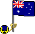 | 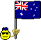 |
| austria | `#austria#fifa` |  | 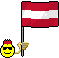 |
| belgium | `#belgium#fifa` | 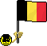 | 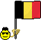 |
| bh | `#bh#fifa` | 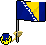 | 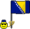 |
| brazil | `#brazil#fifa` | 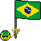 | 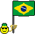 |
| cameroon | `#cameroon#fifa` | 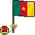 | 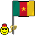 |
| canada | `#canada#fifa` | 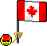 |  |
| capeverde | `#capeverde#fifa` | 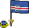 |  |
| colombia | `#colombia#fifa` | 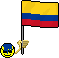 | 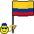 |
| costa_rica | `#costa_rica#fifa` |  |  |
| congo | `#congo#fifa` | 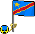 | 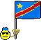 |
| croatia | `#croatia#fifa` | 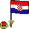 | 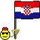 |
| curacao | `#curacao#fifa` | 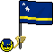 | 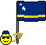 |
| czechia | `#czechia#fifa` | 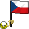 | 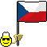 |
| denmark | `#denmark#fifa` |  | 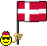 |
| ecuador | `#ecuador#fifa` | 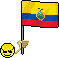 | 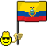 |
| egypt | `#egypt#fifa` | 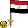 | 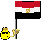 |
| england | `#england#fifa` |  | 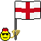 |
| france | `#france#fifa` | 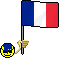 | 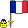 |
| germany | `#germany#fifa` | 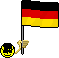 | 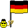 |
| ghana | `#ghana#fifa` | 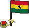 |  |
| haiti | `#haiti#fifa` | 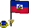 | 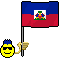 |
| iceland | `#iceland#fifa` | 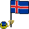 | 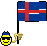 |
| iran | `#iran#fifa` | 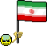 | 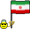 |
| iraq | `#iraq#fifa` | 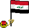 | 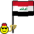 |
| ivorycoast | `#ivorycoast#fifa` | 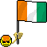 | 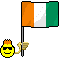 |
| japan | `#japan#fifa` | 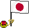 | 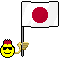 |
| jordan | `#jordan#fifa` | 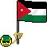 | 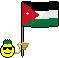 |
| mexico | `#mexico#fifa` | 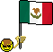 | 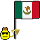 |
| morocco | `#morocco#fifa` | 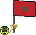 | 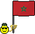 |
| netherlands | `#netherlands#fifa` | 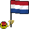 | 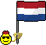 |
| newzealand | `#newzealand#fifa` | 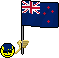 | 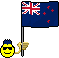 |
| norway | `#norway#fifa` | 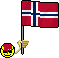 | 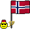 |
| nigeria | `#nigeria#fifa` |  |  |
| panama | `#panama#fifa` | 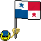 | 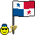 |
| paraguay | `#paraguay#fifa` | 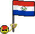 | 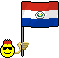 |
| peru | `#peru#fifa` |  | 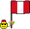 |
| poland | `#poland#fifa` |  | 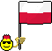 |
| portugal | `#portugal#fifa` | 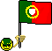 | 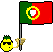 |
| qatar | `#qatar#fifa` |  |  |
| russia | `#russia#fifa` | 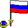 | 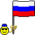 |
| saudi_arabia | `#saudi_arabia#fifa` | 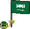 | 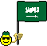 |
| scotland | `#scotland#fifa` | 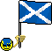 | 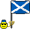 |
| senegal | `#senegal#fifa` | 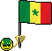 | 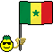 |
| serbia | `#serbia#fifa` | 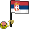 | 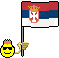 |
| south_africa | `#south_africa#fifa` | 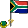 | 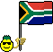 |
| south_korea | `#south_korea#fifa` | 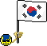 | 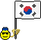 |
| spain | `#spain#fifa` | 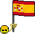 | 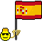 |
| sweden | `#sweden#fifa` | 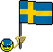 | 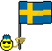 |
| switzerland | `#switzerland#fifa` |  |  |
| tunisia | `#tunisia#fifa` | 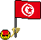 | 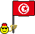 |
| turkey | `#turkey#fifa` | 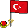 | 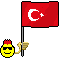 |
| usa | `#usa#fifa` | 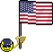 |  |
| uruguay | `#uruguay#fifa` | 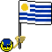 | 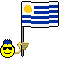 |
| wales | `#wales#fifa` | 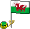 | 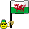 |
| uzbekistan | `#uzbekistan#fifa` | 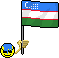 | 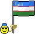 |
| kill_connect | `#kill#fifa #slick#fifa` |  |  |
| kill2_connect | `#banghead#fifa #kill2#fifa` | 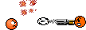 | 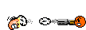 |

