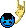
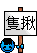
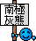

## fs [FS]
| Filename | Emoji | GIF | PNG |
| --- | --- | --- | --- |
| smile | `#:)#fs` |  |  |
| angel | `#O:-)#fs` |  |  |
| dead | `#xx(#fs` |  |  |
| clown | `#:o)#fs` |  |  |
| wink | `#;-)#fs` |  |  |
| angry | `#:-[#fs` |  |  |
| devil | `#:-]#fs` |  |  |
| biggrin | `#:D#fs` |  |  |
| oh | `#:O#fs` |  |  |
| tongue | `#:P#fs` |  |  |
| kiss | `#^3^#fs` |  |  |
| wonder | `#?_?#fs` |  |  |
| agree | `#yup#fs` |  |  |
| love | `#love#fs` |  |  |
| chicken | `#cn#fs` |  |  |
| sosad | `#[sosad]#fs` |  |  |
| good | `#good#fs` |  |  |
| hoho | `#hoho#fs` |  |  |
| kill | `#kill#fs` |  |  |
| bye | `#bye#fs` |  |  |
| adore | `#adore#fs` |  |  |
| wonder2 | `#???#fs` |  |  |
| bouncer | `#[bouncer]#fs` |  |  |
| bouncy | `#[bouncy]#fs` |  |  |
| offtopic | `#[offtopic]#fs` |  |  |
| censored | `#[censored]#fs` |  |  |
| flowerface | `#[flowerface]#fs` |  |  |
| shocking | `#[shocking]#fs` |  |  |
| 369 | `#[369]#fs` |  |  |
| bomb | `#[bomb]#fs` |  |  |
| fuck | `#fuck#fs` |  |  |
| no | `#no#fs` |  |  |
| kill2 | `#kill2#fs` |  |  |
| battle | `#battle#fs` |  |  |
| south_bear | `#bear#fs` |  |  |
| want_die | `#die#fs` |  |  |
| fozen_smile | `#:)#ice#fs` |  |  |
| green_cap | `#gcap#fs` |  |  |
| green_cap_2 | `#gcap2#fs` |  |  |
| green_cap_3 | `#gcap3#fs` |  |  |
| jj | `#jj#fs` |  |  |
| lomore_hoho | `#hoho#lm#fs` |  |  |
| lomore_kill | `#kill#lm#fs` |  |  |
| lomore_smile | `#:)#lm#fs` |  |  |
| poison | `#poison#fs` |  |  |
| pokemon_1 | `#poke1#fs` |  |  |
| pokemon_2 | `#poke2#fs` |  |  |
| superman | `#superman#fs` |  |  |

