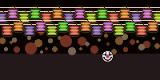
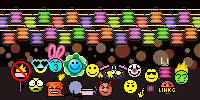
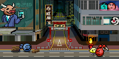

## mf [中秋節版]

### Show On
From 2025-10-05T00:00:00+08:00

To 2025-10-09T00:00:00+08:00

| Filename | Emoji | GIF | PNG |
| --- | --- | --- | --- |
| smile | `#:)#mf` |  |  |
| angel | `#O:-)#mf` |  |  |
| dead | `#xx(#mf` |  |  |
| clown | `#:o)#mf` |  |  |
| frown | `#:-(#mf` |  |  |
| cry | `#:~(#mf` |  |  |
| wink | `#;-)#mf` |  |  |
| angry | `#:-[#mf` |  |  |
| devil | `#:-]#mf` |  |  |
| biggrin | `#:D#mf` |  |  |
| oh | `#:O#mf` |  |  |
| tongue | `#:P#mf` |  |  |
| kiss | `#^3^#mf` |  |  |
| wonder | `#?_?#mf` |  |  |
| agree | `#yup#mf` |  |  |
| donno | `#ng#mf` |  |  |
| hehe | `#hehe#mf` |  |  |
| love | `#love#mf` |  |  |
| surprise | `#oh#mf` |  |  |
| chicken | `#cn#mf` |  |  |
| ass | `#ass#mf` |  |  |
| sosad | `#[sosad]#mf` |  |  |
| good | `#good#mf` |  |  |
| hoho | `#hoho#mf` |  |  |
| kill | `#kill#mf` |  |  |
| bye | `#bye#mf` |  |  |
| z | `#Z_Z#mf` |  |  |
| @ | `#@_@#mf` |  |  |
| adore | `#adore#mf` |  |  |
| wonder2 | `#???#mf` |  |  |
| banghead | `#[banghead]#mf` |  |  |
| bouncer | `#[bouncer]#mf` |  |  |
| bouncy | `#[bouncy]#mf` |  |  |
| offtopic | `#[offtopic]#mf` |  |  |
| censored | `#[censored]#mf` |  |  |
| flowerface | `#[flowerface]#mf` |  |  |
| shocking | `#[shocking]#mf` |  |  |
| photo | `#[photo]#mf` |  |  |
| fire | `#fire#mf` |  |  |
| yipes | `#[yipes]#mf` |  |  |
| 369 | `#[369]#mf` |  |  |
| bomb | `#[bomb]#mf` |  |  |
| slick | `#[slick]#mf` |  |  |
| fuck | `#fuck#mf` |  |  |
| no | `#no#mf` |  |  |
| kill2 | `#kill2#mf` |  |  |
| special | `#:o)#mf #:)#mf` |  |  |
| special2 | `#:o)#mf #hoho#mf` |  |  |
| special3 | `#:o)#mf #good#mf` |  |  |
| special4 | `#:o)#mf #:-(#mf` |  |  |
| special5 | `#bye#mf #:)#mf` |  |  |
| special6 | `#[photo]#mf #:)#mf` |  |  |
| special7 | `#@_@#mf #:-[#mf` |  |  |
| special8 | `#ng#mf #cn#mf` |  |  |

