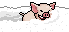

## pigxm [連豬聖誕版]

### Show On
From 2025-12-15T00:00:00+08:00

To 2025-12-31T23:59:59+08:00

| Filename | Emoji | GIF | PNG |
| --- | --- | --- | --- |
| smile | `#:)#pigxm` |  |  |
| hate | `#:[#pigxm` |  |  |
| smirk | `#:-]#pigxm` |  |  |
| hehe | `#hehe#pigxm` |  |  |
| mock | `#mock#pigxm` |  |  |
| clap | `#clap#pigxm` |  |  |
| snowhat | `#snowhat#pigxm` |  |  |
| bye | `#bye#pigxm` |  |  |
| cut | `#cut#pigxm` |  |  |
| cook | `#cooking#pigxm` |  |  |
| fry | `#fry#pigxm` |  |  |
| fan | `#fan#pigxm` |  |  |
| peanut | `#peanut#pigxm` |  |  |
| wine | `#wine#pigxm` |  |  |
| champagne | `#champagne#pigxm` |  |  |
| play | `#play#pigxm` |  |  |
| whip | `#whip#pigxm` |  |  |
| shocked | `#shocking#pigxm` |  |  |
| read | `#read#pigxm` |  |  |
| heard | `#heard#pigxm` |  |  |
| nope | `#nope#pigxm` |  |  |
| pointing | `#pointing#pigxm` |  |  |
| argue | `#argue#pigxm` |  |  |
| drum | `#drum#pigxm` |  |  |
| speakerphone | `#speakerphone#pigxm` |  |  |
| sad_n_angry | `#;-[#pigxm` |  |  |
| angry | `#:-[#pigxm` |  |  |
| knife | `#kill#pigxm` |  |  |
| arrested | `#arrested#pigxm` |  |  |
| upset_r | `#upset_r#pigxm` |  |  |
| wail_r | `#wail_r#pigxm` |  |  |
| wail2_r | `#wail2_r#pigxm` |  |  |
| wail3_r | `#wail3_r#pigxm` |  |  |
| arrested_g | `#arrested_g#pigxm` |  |  |
| upset | `#upset#pigxm` |  |  |
| wail | `#wail#pigxm` |  |  |
| wail2 | `#wail2#pigxm` |  |  |
| wail3 | `#wail3#pigxm` |  |  |
| sick | `#sick#pigxm` |  |  |
| dance | `#dance#pigxm` |  |  |
| dance2 | `#dance2#pigxm` |  |  |
| dance3 | `#dance3#pigxm` |  |  |
| dance4 | `#dance4#pigxm` |  |  |
| rolling | `#rolling#pigxm` |  |  |
| dying | `#dying#pigxm` |  |  |
| surviving | `#surviving#pigxm` |  |  |
| free | `#free#pigxm` |  |  |
| lihkg | `#lihkg#pigxm` |  |  |
| whip_special | `#play#pigxm #whip#pigxm` |  |  |
| whip_connect | `#whip#pigxm #fight2#dogxm` |  |  |
| knife_connect | `#fight1#dogxm #kill#pigxm` |  |  |
| argue_connect | `#stop#dogxm #argue#pigxm` |  |  |
| cook_connect | `#cooking#pigxm #fan#pigxm` |  |  |

