## lm2 [腦魔2]
| Filename | Emoji | GIF | PNG |
| --- | --- | --- | --- |
| smile | `#:)#lm2` |  |  |
| clown | `#:o)#lm2` |  |  |
| kill | `#kill#lm2` |  |  |
| shield | `#shield#lm2` | 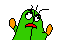 |  |
| bye | `#bye#lm2` |  |  |
| eating | `#eating#lm2` |  |  |
| yo | `#yo#lm2` |  |  |
| sosick | `#[sosick]#lm2` |  |  |
| mask | `#mask#lm2` |  |  |
| diu | `#diu#lm2` |  | 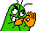 |
| touch | `#touch#lm2` |  |  |
| wet | `#wet#lm2` |  |  |
| jable | `#jable#lm2` |  |  |
| tongue | `#:P#lm2` |  |  |
| tongue2 | `#tongue2#lm2` |  |  |
| tongue3 | `#tongue3#lm2` |  |  |
| tongue4 | `#tongue4#lm2` |  |  |
| lick | `#lick#lm2` |  |  |
| spinning | `#spinning#lm2` |  |  |
| spinning2 | `#spinning2#lm2` |  |  |
| bouncer | `#[bouncer]#lm2` |  |  |
| huh | `#huh#lm2` |  |  |
| dead | `#xx(#lm2` |  |  |
| wonder2 | `#???#lm2` |  | 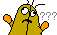 |
| wfc2 | `#wfc2#lm2` |  | 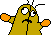 |
| support | `#support#lm2` |  |  |
| sosad | `#[sosad]#lm2` |  |  |
| haha | `#haha#lm2` |  |  |
| nosee | `#nosee#lm2` |  |  |
| hoho | `#hoho#lm2` |  |  |
| aha | `#aha#lm2` |  |  |
| love | `#love#lm2` |  |  |
| chu | `#chu#lm2` |  |  |
| hehe | `#hehe#lm2` |  |  |
| hehe2 | `#hehe2#lm2` |  |  |
| photo | `#[photo]#lm2` |  |  |
| point1 | `#point1#lm2` |  |  |
| point2 | `#point2#lm2` |  |  |
| beer | `#beer#lm2` |  |  |
| agree | `#yup#lm2` |  |  |
| slick | `#[slick]#lm2` |  |  |
| yeah | `#yeah#lm2` |  |  |
| donno | `#ng#lm2` |  |  |
| no | `#no#lm2` | 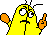 |  |
| brain | `#brain#lm2` |  |  |
| shock | `#shock#lm2` |  |  |
| fear | `#fear#lm2` |  |  |
| oh | `#:O#lm2` |  | 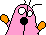 |
| bang | `#bang#lm2` |  |  |
| silly | `#silly#lm2` |  |  |
| 369 | `#[369]#lm2` | 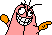 |  |
| dllm | `#dllm#lm2` | 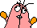 | 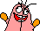 |
| what | `#what#lm2` |  |  |
| fuck | `#fuck#lm2` |  |  |
| bomb2 | `#[bomb2]#lm2` | 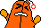 |  |
| bomb | `#[bomb]#lm2` |  |  |
| shoot | `#shoot#lm2` |  |  |
| hate | `#hate#lm2` |  |  |
| angry | `#:-[#lm2` |  |  |
| angry2 | `#angry2#lm2` |  |  |
| aura | `#aura#lm2` |  |  |
| saber | `#saber#lm2` | 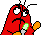 |  |
| punch | `#punch#lm2` |  |  |
| danger | `#danger#lm2` |  | 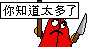 |
| dislike | `#dislike#lm2` |  |  |
| good | `#good#lm2` |  |  |
| ok | `#ok#lm2` |  |  |
| go | `#go#lm2` |  |  |
| drop | `#drop#lm2` |  |  |
| rise | `#rise#lm2` |  |  |
| wfc | `#wfc#lm2` |  | 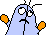 |
| think | `#think#lm2` |  |  |
| bandage | `#bandage#lm2` |  |  |
| adore | `#adore#lm2` |  |  |
| kiss2 | `#^3^#lm2` |  |  |
| kiss | `#kiss#lm2` |  |  |
| nothing | `#nothing#lm2` |  |  |
| flowerface | `#[flowerface]#lm2` |  |  |
| muscle | `#muscle#lm2` |  |  |
| tear | `#tear#lm2` |  |  |
| frown | `#:-(#lm2` |  |  |
| frownsmile | `#frownsmile#lm2` |  |  |
| angelsmile | `#angelsmile#lm2` |  |  |
| z | `#Z_Z#lm2` |  |  |
| noodles | `#noodles#lm2` |  |  |
| lightbulb | `#lightbulb#lm2` | 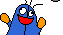 |  |
| abomb | `#[abomb]#lm2` |  |  |
| selfdestruct | `#selfdestruct#lm2` |  |  |
| shocking | `#[shocking]#lm2` |  |  |
| @ | `#@_@#lm2` |  |  |
| yipes | `#[yipes]#lm2` |  |  |
| uggh | `#uggh#lm2` |  |  |
| cry | `#:~(#lm2` |  |  |
| dust | `#dust#lm2` |  |  |
| evil | `#evil#lm2` |  |  |
| ghost | `#ghost#lm2` |  |  |
| credit | `#credit#lm2` |  |  |

