## pig [連豬]
| Filename | Emoji | GIF | PNG |
| --- | --- | --- | --- |
| smile | `#:)#pig` |  |  |
| hate | `#:[#pig` |  |  |
| smirk | `#:-]#pig` |  |  |
| hehe | `#hehe#pig` |  |  |
| mock | `#mock#pig` | 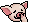 |  |
| clap | `#clap#pig` |  |  |
| sowhat | `#sowhat#pig` | 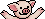 |  |
| bye | `#bye#pig` | 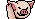 |  |
| cut | `#cut#pig` |  |  |
| cook | `#cooking#pig` |  |  |
| fry | `#fry#pig` |  |  |
| fan | `#fan#pig` |  |  |
| peanut | `#peanut#pig` | 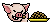 |  |
| wine | `#wine#pig` |  |  |
| champagne | `#champagne#pig` | 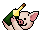 |  |
| play | `#play#pig` |  | 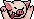 |
| whip | `#whip#pig` |  |  |
| shocked | `#shocking#pig` |  |  |
| read | `#read#pig` |  |  |
| heard | `#heard#pig` |  |  |
| nope | `#nope#pig` |  |  |
| pointing | `#pointing#pig` | 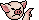 |  |
| argue | `#argue#pig` |  |  |
| drum | `#drum#pig` |  |  |
| speakerphone | `#speakerphone#pig` |  |  |
| sad_n_angry | `#;-[#pig` |  |  |
| angry | `#:-[#pig` |  |  |
| knife | `#kill#pig` | 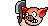 |  |
| arrested | `#arrested#pig` | 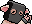 | 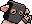 |
| upset | `#upset#pig` | 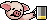 | 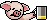 |
| wail | `#wail#pig` |  |  |
| wail2 | `#wail2#pig` |  |  |
| wail3 | `#wail3#pig` |  |  |
| sick | `#sick#pig` |  |  |
| dance | `#dance#pig` |  |  |
| dance2 | `#dance2#pig` |  |  |
| dance3 | `#dance3#pig` |  | 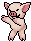 |
| dance4 | `#dance4#pig` |  | 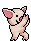 |
| rolling | `#rolling#pig` |  |  |
| dying | `#dying#pig` |  |  |
| surviving | `#surviving#pig` |  |  |
| free | `#free#pig` |  |  |
| lihkg | `#lihkg#pig` |  |  |
| whip_special | `#play#pig #whip#pig` |  | 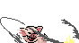 |
| whip_connect | `#whip#pig #fight2#dog` | 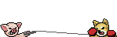 | 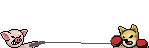 |
| knife_connect | `#fight1#dog #kill#pig` |  |  |
| cook_connect | `#cooking#pig #fan#pig` |  |  |
| wine_connect | `#wine#pig #champagne#pig` |  |  |

