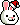
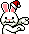
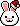
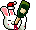
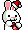
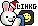

## rabbitxm [連兔聖誕版]
| Filename | Emoji | GIF | PNG |
| --- | --- | --- | --- |
| smile | `#:)#rabbitxm` |  |  |
| smile2 | `#smile2#rabbitxm` |  |  |
| happy | `#happy#rabbitxm` |  |  |
| haha | `#haha#rabbitxm` |  |  |
| clap | `#clap#rabbitxm` |  |  |
| agree | `#agree#rabbitxm` |  |  |
| music | `#music#rabbitxm` |  |  |
| bye | `#bye#rabbitxm` |  |  |
| blink | `#blink#rabbitxm` |  |  |
| hear | `#hear#rabbitxm` |  |  |
| confuse | `#confuse#rabbitxm` |  |  |
| wtf | `#wtf#rabbitxm` |  |  |
| angry | `#:-[#rabbitxm` |  |  |
| axe | `#axe#rabbitxm` |  |  |
| banghead | `#banghead#rabbitxm` |  |  |
| orange | `#orange#rabbitxm` |  |  |
| emo | `#emo#rabbitxm` |  |  |
| dance | `#dance#rabbitxm` |  |  |
| sweat | `#sweat#rabbitxm` |  |  |
| trauma | `#trauma#rabbitxm` |  |  |
| sad | `#sad#rabbitxm` |  |  |
| creepy | `#creepy#rabbitxm` |  |  |
| scary | `#scary#rabbitxm` |  |  |
| drink | `#drink#rabbitxm` |  |  |
| eat | `#eat#rabbitxm` |  |  |
| saw | `#saw#rabbitxm` |  |  |
| stun | `#stun#rabbitxm` |  |  |
| tape | `#tape#rabbitxm` |  |  |
| yawn | `#yawn#rabbitxm` |  |  |
| fly | `#fly#rabbitxm` |  |  |
| lihkg | `#lihkg#rabbitxm` |  |  |

