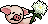
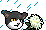
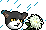
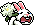

## rip [RIP]
| Filename | Emoji | GIF | PNG |
| --- | --- | --- | --- |
| flower | `#flower#rip` |  |  |
| dog | `#dog#rip` |  |  |
| pig | `#pig#rip` |  |  |
| mouse | `#mouse#rip` |  |  |
| cat | `#cat#rip` |  |  |
| cow | `#cow#rip` |  |  |
| tiger | `#tiger#rip` |  |  |
| rabbit | `#rabbit#rip` |  |  |

